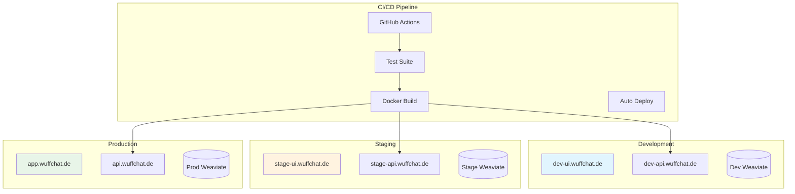

# 🏢 WuffChat Enterprise Setup: Dev/Stage/Prod with CI/CD

## Overview
This guide outlines a professional development workflow with proper environments, automated testing, and production-grade deployment for WuffChat.

## Current State Assessment ✅
- ✅ **Excellent V2 Architecture**: Clean, testable, production-ready
- ✅ **Comprehensive Tests**: 119 tests, perfect for CI/CD
- ✅ **Container-Ready**: Already works with Scalingo containers
- ✅ **Environment Variables**: Proper config management

---

## 🏗️ Recommended Architecture

### Infrastructure Overview


---

## 🔧 1. Infrastructure Setup

### 1.1 Hosting Platform Options

#### **Option A: Scalingo (Current + Expand)**
```yaml
# Recommended: Scale your current setup
Apps:
  - wuffchat-dev-api      # dev-api.wuffchat.de
  - wuffchat-stage-api    # stage-api.wuffchat.de  
  - wuffchat-prod-api     # api.wuffchat.de (current)
  
  - wuffchat-dev-ui       # dev-ui.wuffchat.de
  - wuffchat-stage-ui     # stage-ui.wuffchat.de
  - wuffchat-prod-ui      # app.wuffchat.de (current)

Advantages:
+ Familiar platform
+ Built-in SSL certificates
+ Easy environment management
+ European hosting (GDPR)
+ Simple scaling
```

#### **Option B: AWS/Google Cloud (Enterprise)**
```yaml
Services:
  - ECS/Cloud Run: Container orchestration
  - ALB/Load Balancer: Traffic routing
  - RDS/Cloud SQL: Managed databases
  - CloudFront/CDN: Global distribution
  - Route53/Cloud DNS: Domain management
  - ACM/Certificate Manager: SSL automation

Advantages:
+ More control and features
+ Better monitoring/analytics
+ Advanced networking
- More complex setup
- Higher costs for small scale
```

#### **Option C: Digital Ocean App Platform**
```yaml
Setup:
  - Simple, similar to Scalingo
  - Built-in CI/CD
  - Competitive pricing
  - Good for startups

Advantages:
+ Middle ground complexity
+ Good documentation
+ Predictable pricing
```

### 1.2 Domain Structure
```
Production:
├── app.wuffchat.de          # Frontend
├── api.wuffchat.de          # Backend API
└── admin.wuffchat.de        # Admin dashboard (future)

Staging:
├── stage-app.wuffchat.de    # Frontend staging
├── stage-api.wuffchat.de    # Backend staging
└── stage-admin.wuffchat.de  # Admin staging

Development:
├── dev-app.wuffchat.de      # Frontend dev
├── dev-api.wuffchat.de      # Backend dev
└── dev-admin.wuffchat.de    # Admin dev
```

---

## 🔄 2. CI/CD Pipeline Design

### 2.1 GitHub Actions Workflow

#### **Backend Pipeline** (`.github/workflows/backend.yml`)
```yaml
name: WuffChat Backend CI/CD

on:
  push:
    branches: [main, develop]
    paths: ['src/**', 'tests/**', 'requirements.txt']
  pull_request:
    branches: [main, develop]

jobs:
  test:
    runs-on: ubuntu-latest
    steps:
      - uses: actions/checkout@v4
      
      - name: Set up Python
        uses: actions/setup-python@v4
        with:
          python-version: '3.11'
          
      - name: Cache dependencies
        uses: actions/cache@v3
        with:
          path: ~/.cache/pip
          key: ${{ runner.os }}-pip-${{ hashFiles('requirements.txt') }}
          
      - name: Install dependencies
        run: |
          pip install -r requirements.txt
          pip install -r requirements-dev.txt
          
      - name: Run tests
        run: |
          pytest --cov=src --cov-report=xml --cov-report=html
          
      - name: Upload coverage
        uses: codecov/codecov-action@v3
        
  deploy-dev:
    needs: test
    if: github.ref == 'refs/heads/develop'
    runs-on: ubuntu-latest
    steps:
      - name: Deploy to Development
        run: |
          # Deploy to dev-api.wuffchat.de
          
  deploy-staging:
    needs: test
    if: github.ref == 'refs/heads/main'
    runs-on: ubuntu-latest
    steps:
      - name: Deploy to Staging
        run: |
          # Deploy to stage-api.wuffchat.de
          
  deploy-prod:
    needs: deploy-staging
    if: github.ref == 'refs/heads/main' && github.event_name == 'push'
    runs-on: ubuntu-latest
    environment: production
    steps:
      - name: Deploy to Production
        run: |
          # Deploy to api.wuffchat.de
```

#### **Frontend Pipeline** (in dogbot-ui repo)
```yaml
name: WuffChat Frontend CI/CD

on:
  push:
    branches: [main, develop]
  pull_request:
    branches: [main, develop]

jobs:
  test:
    runs-on: ubuntu-latest
    steps:
      - uses: actions/checkout@v4
      - uses: actions/setup-node@v4
        with:
          node-version: '18'
          cache: 'npm'
          
      - run: npm ci
      - run: npm run test
      - run: npm run build
      
  deploy-dev:
    needs: test
    if: github.ref == 'refs/heads/develop'
    environment: development
    steps:
      - name: Deploy to Dev
        run: |
          # Deploy to dev-app.wuffchat.de
          
  deploy-staging:
    needs: test
    if: github.ref == 'refs/heads/main'
    environment: staging
    steps:
      - name: Deploy to Staging
        run: |
          # Deploy to stage-app.wuffchat.de
          
  deploy-prod:
    needs: deploy-staging
    environment: production
    steps:
      - name: Deploy to Production
        run: |
          # Deploy to app.wuffchat.de
```

### 2.2 Branch Strategy
```
main branch:
├── Protected branch
├── Requires PR reviews
├── Triggers staging deployment
├── Manual approval for production

develop branch:
├── Development integration
├── Triggers dev deployment
├── Feature branch target

feature/* branches:
├── Feature development
├── PR target: develop
├── Temporary environments (optional)
```

---

## 🔒 3. Security & Certificates

### 3.1 SSL Certificate Management

#### **Option A: Platform-Managed (Recommended)**
```yaml
# Scalingo/Platform automatic SSL
Certificates:
  - api.wuffchat.de: Auto-renewed Let's Encrypt
  - app.wuffchat.de: Auto-renewed Let's Encrypt
  - stage-api.wuffchat.de: Auto-renewed Let's Encrypt
  
Benefits:
+ Zero management overhead
+ Automatic renewal
+ Wildcard support
+ Platform integrated
```

#### **Option B: CloudFlare (Advanced)**
```yaml
# CloudFlare proxy + SSL
Setup:
  - CloudFlare as DNS provider
  - Proxy all traffic through CF
  - Universal SSL + Advanced Security
  
Benefits:
+ DDoS protection
+ Global CDN
+ Advanced security rules
+ Analytics and monitoring
```

### 3.2 Environment Security
```yaml
Secrets Management:
  Development:
    - Basic API keys
    - Development databases
    - Debug logging enabled
    
  Staging:
    - Production-like secrets
    - Staging databases
    - Reduced logging
    
  Production:
    - Encrypted secrets
    - Production databases
    - Minimal logging
    - WAF protection
```

---

## 🗄️ 4. Database & Service Architecture

### 4.1 Environment Separation
```yaml
Weaviate Instances:
  Development:
    - wuffchat-dev.weaviate.network
    - Small instance, shared data OK
    - Frequent schema changes allowed
    
  Staging:
    - wuffchat-stage.weaviate.network
    - Production-like data
    - Schema matches production
    
  Production:
    - wuffchat-prod.weaviate.network
    - Full production data
    - Strict schema management
    - Backups and monitoring

Redis Instances:
  Development: redis://dev-redis.example.com
  Staging: redis://stage-redis.example.com
  Production: redis://prod-redis.example.com
```

### 4.2 Service Configuration
```python
# src/v2/core/config.py
class Settings:
    environment: str = "development"
    
    # Database URLs
    weaviate_url: str
    weaviate_api_key: str
    redis_url: Optional[str] = None
    
    # API Keys
    openai_api_key: str
    
    # Feature Flags
    enable_caching: bool = True
    enable_monitoring: bool = False
    debug_mode: bool = False
    
    @classmethod
    def for_environment(cls, env: str):
        if env == "production":
            return cls(
                enable_monitoring=True,
                debug_mode=False,
                enable_caching=True
            )
        elif env == "staging":
            return cls(
                enable_monitoring=True,
                debug_mode=False,
                enable_caching=True
            )
        else:  # development
            return cls(
                enable_monitoring=False,
                debug_mode=True,
                enable_caching=False
            )
```

---

## 📊 5. Monitoring & Observability

### 5.1 Application Monitoring
```yaml
Metrics to Track:
  Performance:
    - Response time (p95, p99)
    - Request rate
    - Error rate
    - Database query time
    
  Business:
    - Conversation completion rate
    - User satisfaction scores
    - Feature usage analytics
    - Error types and frequency
    
  Infrastructure:
    - CPU/Memory usage
    - Container health
    - Database connections
    - Cache hit rates
```

### 5.2 Monitoring Stack Options

#### **Option A: Platform Built-in**
```yaml
# Scalingo metrics + logs
Tools:
  - Scalingo Metrics: Basic performance
  - Scalingo Logs: Application logs
  - Scalingo Alerts: Threshold alerts
  
Pros:
+ Integrated with platform
+ No additional setup
+ Basic needs covered
```

#### **Option B: External Monitoring**
```yaml
# Professional monitoring stack
Tools:
  - Sentry: Error tracking and performance
  - DataDog/New Relic: Full observability
  - LogRocket: Frontend session replay
  - UptimeRobot: Uptime monitoring
  
Pros:
+ Professional features
+ Advanced analytics
+ Better debugging tools
- Additional cost and complexity
```

### 5.3 Health Checks & Alerts
```python
# Enhanced health checks for monitoring
@app.get("/health")
async def health_check():
    return {
        "status": "healthy",
        "environment": settings.environment,
        "version": "v2.1.0",
        "timestamp": datetime.utcnow().isoformat(),
        "services": {
            "weaviate": await check_weaviate_health(),
            "redis": await check_redis_health(),
            "openai": await check_openai_health()
        }
    }

@app.get("/health/detailed")
async def detailed_health():
    return {
        **health_check(),
        "metrics": {
            "active_sessions": get_active_session_count(),
            "conversations_today": get_daily_conversation_count(),
            "average_response_time": get_avg_response_time(),
            "error_rate_1h": get_hourly_error_rate()
        }
    }
```

---

## 🚀 6. Implementation Roadmap

### Phase 1: Infrastructure Setup (Week 1)
```yaml
Tasks:
  - [ ] Create staging environment on Scalingo
  - [ ] Set up domain routing (stage-api.wuffchat.de)
  - [ ] Configure staging Weaviate instance
  - [ ] Set up basic GitHub Actions
  - [ ] Test staging deployment
```

### Phase 2: CI/CD Pipeline (Week 2)
```yaml
Tasks:
  - [ ] Complete GitHub Actions workflows
  - [ ] Set up automated testing
  - [ ] Configure deployment secrets
  - [ ] Test automated deployments
  - [ ] Set up branch protection rules
```

### Phase 3: Production Migration (Week 3)
```yaml
Tasks:
  - [ ] Deploy current V2 to staging
  - [ ] Full testing on staging environment
  - [ ] Production deployment via CI/CD
  - [ ] Frontend updates for new workflow
  - [ ] Monitor and validate
```

### Phase 4: Enhancement (Week 4+)
```yaml
Tasks:
  - [ ] Advanced monitoring setup
  - [ ] Performance optimization
  - [ ] Security hardening
  - [ ] Documentation completion
  - [ ] Team onboarding materials
```

---

## 💰 7. Cost Estimation

### Scalingo-Based Setup (Recommended)
```yaml
Monthly Costs (EUR):
  Backend Apps:
    - Dev API: €7/month (S container)
    - Staging API: €14/month (M container)
    - Prod API: €28/month (L container)
    
  Frontend Apps:
    - Dev UI: €7/month (S container)
    - Staging UI: €14/month (M container)  
    - Prod UI: €28/month (L container)
    
  External Services:
    - Weaviate Cloud: €50-200/month (depends on usage)
    - Redis: €10-30/month (if separate instances)
    - Domain/SSL: €0 (included)
    
Total: ~€158-350/month

Growth Path:
  - Start with shared dev/staging resources
  - Scale up as usage grows
  - Add monitoring services later
```

### AWS/GCP Setup (Enterprise)
```yaml
Monthly Costs (USD):
  Compute:
    - 3x Container instances: $50-150/month
    - Load balancers: $20/month
    - NAT Gateway: $45/month
    
  Storage & Database:
    - Managed databases: $50-200/month
    - File storage: $10-30/month
    
  Networking:
    - Domain management: $1/month
    - SSL certificates: Free (Let's Encrypt)
    - CDN: $10-50/month
    
  Monitoring:
    - CloudWatch/Monitoring: $20-100/month
    
Total: ~$206-596/month

Note: Higher costs but more features and control
```

---

## 🎯 8. Success Metrics

### Development Velocity
- [ ] **Deployment Time**: < 10 minutes from push to live
- [ ] **Test Feedback**: < 5 minutes for test results
- [ ] **Rollback Time**: < 2 minutes for production issues
- [ ] **Environment Parity**: 99% staging/production match

### Quality Assurance  
- [ ] **Test Coverage**: > 90% for new code
- [ ] **Uptime**: > 99.9% for production
- [ ] **Performance**: < 2s response time p95
- [ ] **Security**: Zero security incidents

### Team Productivity
- [ ] **Developer Onboarding**: < 1 hour to productive
- [ ] **Feature Delivery**: Predictable weekly releases
- [ ] **Bug Resolution**: < 24h for critical issues
- [ ] **Documentation**: Always up-to-date

---

## 🚦 Quick Start Recommendation

### For Immediate Implementation:
1. **Start with Scalingo expansion** (familiar, cost-effective)
2. **Create staging environment first** (test the workflow)
3. **Implement basic CI/CD** (GitHub Actions + automated tests)
4. **Add monitoring gradually** (start with built-in tools)

### Your V2 Advantages:
- ✅ **Already container-ready**
- ✅ **Excellent test coverage for CI/CD**
- ✅ **Clean architecture scales well**
- ✅ **Environment-based configuration ready**

**You're in an excellent position to implement this! Your V2 codebase is perfect for a professional setup.** 🎉

---

*Need help implementing any specific part? I can provide detailed implementation guides for each phase.*