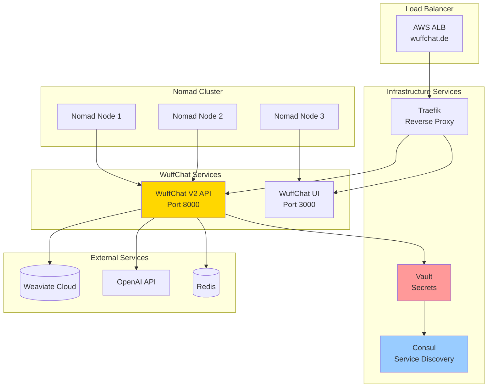

# 🎯 WuffChat V2 on Nomad Infrastructure

## Overview
Your existing Nomad + Vault + Consul infrastructure is actually **excellent** for modern deployments. This setup provides more control and cost-effectiveness than managed services while maintaining enterprise-grade security.

## Your Infrastructure Advantages ✨

### **Current Strengths:**
- ✅ **Nomad Cluster**: Modern container orchestration (alternative to Kubernetes)
- ✅ **Vault Integration**: Enterprise secrets management
- ✅ **mTLS Security**: Secure inter-service communication
- ✅ **Infrastructure as Code**: Terraform-based reproducible infrastructure
- ✅ **Multi-Environment Ready**: Can easily scale to dev/staging/prod

### **Why This is Great for WuffChat:**
- 🚀 **Perfect for V2**: Your container-ready codebase fits perfectly
- 💰 **Cost Efficient**: More control over resources than managed services
- 🔒 **Security**: Vault handles all secrets (OpenAI keys, Weaviate tokens)
- 📈 **Scalable**: Nomad auto-scaling for traffic spikes
- 🛠️ **Control**: Full control over runtime environment

---

## 🔄 Modernization Assessment

### What's Still Excellent (Keep):
```yaml
Core Architecture:
  ✅ Nomad for orchestration (modern alternative to K8s)
  ✅ Vault for secrets management
  ✅ Consul for service discovery
  ✅ Docker containerization
  ✅ Terraform Infrastructure as Code
```

### What Needs Updates (2023 → 2025):
```yaml
Likely Updates Needed:
  🔄 Terraform providers (AWS ~4.x → 5.x)
  🔄 Nomad version (1.4 → 1.7+)
  🔄 Vault version (1.12 → 1.15+)
  🔄 Security hardening (newer TLS, policies)
  🔄 CI/CD integration
  🔄 Monitoring/observability
```

---

## 🏗️ WuffChat Deployment Architecture

### Target Architecture


### Nomad Job Definitions

#### **WuffChat API Job**
```hcl
# jobs/wuffchat-api.nomad
job "wuffchat-api" {
  datacenters = ["dc1"]
  type        = "service"
  
  group "api" {
    count = 2  # High availability
    
    network {
      port "http" {
        to = 8000
      }
    }
    
    service {
      name = "wuffchat-api"
      port = "http"
      
      tags = [
        "api",
        "wuffchat",
        "traefik.enable=true",
        "traefik.http.routers.wuffchat-api.rule=Host(`api.wuffchat.de`)",
        "traefik.http.routers.wuffchat-api.tls=true"
      ]
      
      check {
        type     = "http"
        path     = "/health"
        interval = "10s"
        timeout  = "3s"
      }
      
      check {
        type     = "http"
        path     = "/v2/health"
        interval = "30s"
        timeout  = "5s"
      }
    }
    
    task "wuffchat-api" {
      driver = "docker"
      
      config {
        image = "your-registry/wuffchat-api:${version}"
        ports = ["http"]
        
        # Your V2 API is perfect for this!
        args = [
          "python", "-m", "uvicorn", 
          "src.v2.main:app", 
          "--host", "0.0.0.0", 
          "--port", "8000"
        ]
      }
      
      # Vault integration for secrets
      vault {
        policies = ["wuffchat-api"]
      }
      
      template {
        data = <<EOF
OPENAI_APIKEY="{{with secret "secret/wuffchat/openai"}}{{.Data.data.api_key}}{{end}}"
WEAVIATE_URL="{{with secret "secret/wuffchat/weaviate"}}{{.Data.data.url}}{{end}}"
WEAVIATE_API_KEY="{{with secret "secret/wuffchat/weaviate"}}{{.Data.data.api_key}}{{end}}"
REDIS_URL="{{with secret "secret/wuffchat/redis"}}{{.Data.data.url}}{{end}}"
ENVIRONMENT="{{ env "NOMAD_META_environment" }}"
LOG_LEVEL="INFO"
EOF
        destination = "secrets/app.env"
        env         = true
      }
      
      resources {
        cpu    = 500   # 0.5 CPU cores
        memory = 1024  # 1GB RAM
      }
      
      # Auto-scaling based on CPU/memory
      scaling {
        min     = 2
        max     = 10
        enabled = true
        
        policy {
          cooldown            = "2m"
          evaluation_interval = "30s"
          
          check "cpu_usage" {
            source = "prometheus"
            query  = "nomad_client_allocs_cpu_percent"
            
            strategy "target-value" {
              target = 70
            }
          }
        }
      }
    }
  }
}
```

#### **WuffChat UI Job**
```hcl
# jobs/wuffchat-ui.nomad
job "wuffchat-ui" {
  datacenters = ["dc1"]
  type        = "service"
  
  group "ui" {
    count = 2
    
    network {
      port "http" {
        to = 3000
      }
    }
    
    service {
      name = "wuffchat-ui"
      port = "http"
      
      tags = [
        "ui",
        "frontend",
        "traefik.enable=true",
        "traefik.http.routers.wuffchat-ui.rule=Host(`app.wuffchat.de`)",
        "traefik.http.routers.wuffchat-ui.tls=true"
      ]
      
      check {
        type     = "http"
        path     = "/"
        interval = "10s"
        timeout  = "3s"
      }
    }
    
    task "wuffchat-ui" {
      driver = "docker"
      
      config {
        image = "your-registry/wuffchat-ui:${version}"
        ports = ["http"]
      }
      
      env {
        REACT_APP_API_URL = "https://api.wuffchat.de"
        NODE_ENV = "production"
      }
      
      resources {
        cpu    = 200
        memory = 512
      }
    }
  }
}
```

### Vault Secrets Structure
```bash
# Store secrets in Vault
vault kv put secret/wuffchat/openai api_key="sk-..."
vault kv put secret/wuffchat/weaviate url="https://..." api_key="..."
vault kv put secret/wuffchat/redis url="redis://..."

# Create policy for WuffChat API
vault policy write wuffchat-api - <<EOF
path "secret/data/wuffchat/*" {
  capabilities = ["read"]
}
EOF
```

---

## 🚀 Deployment Strategy

### Phase 1: Infrastructure Modernization (Week 1)
```bash
# 1. Update your existing Terraform
cd /path/to/nomad-vault-docker-flask
git pull  # Get any updates

# 2. Check current versions
terraform version
nomad version
vault version

# 3. Update provider versions in versions.tf
# 4. Plan and apply updates incrementally
terraform plan
terraform apply
```

### Phase 2: WuffChat Integration (Week 2)
```bash
# 1. Add WuffChat secrets to Vault
# 2. Create Nomad job definitions
# 3. Build and push Docker images
# 4. Deploy to development first

# Deploy API
nomad job run jobs/wuffchat-api.nomad

# Deploy UI  
nomad job run jobs/wuffchat-ui.nomad

# Check status
nomad status wuffchat-api
nomad status wuffchat-ui
```

### Phase 3: Production Deployment (Week 3)
```bash
# 1. Test thoroughly in staging
# 2. Update DNS to point to load balancer
# 3. Deploy production with zero downtime
# 4. Monitor and validate
```

---

## 🔧 Required Infrastructure Updates

### Terraform Modernization
```hcl
# Update versions.tf (likely needs updating)
terraform {
  required_version = ">= 1.9"
  
  required_providers {
    aws = {
      source  = "hashicorp/aws"
      version = "~> 5.0"  # Updated from ~> 4.0
    }
    nomad = {
      source  = "hashicorp/nomad"
      version = "~> 2.0"  # Check latest
    }
    vault = {
      source  = "hashicorp/vault"
      version = "~> 4.0"  # Check latest
    }
  }
}
```

### Load Balancer Configuration
```hcl
# Add to your Terraform for WuffChat domains
resource "aws_lb_target_group" "wuffchat_api" {
  name     = "wuffchat-api"
  port     = 8000
  protocol = "HTTP"
  vpc_id   = var.vpc_id
  
  health_check {
    enabled             = true
    healthy_threshold   = 2
    unhealthy_threshold = 2
    timeout             = 5
    interval            = 30
    path                = "/health"
    matcher             = "200"
  }
}

resource "aws_lb_listener_rule" "wuffchat_api" {
  listener_arn = aws_lb_listener.main.arn
  priority     = 100
  
  action {
    type             = "forward"
    target_group_arn = aws_lb_target_group.wuffchat_api.arn
  }
  
  condition {
    host_header {
      values = ["api.wuffchat.de"]
    }
  }
}
```

---

## 🔄 CI/CD Pipeline Integration

### GitHub Actions for Nomad Deployment
```yaml
# .github/workflows/deploy-nomad.yml
name: Deploy to Nomad

on:
  push:
    branches: [main, develop]

jobs:
  deploy:
    runs-on: ubuntu-latest
    
    steps:
      - uses: actions/checkout@v4
      
      - name: Build Docker Image
        run: |
          docker build -t wuffchat-api:${{ github.sha }} .
          docker tag wuffchat-api:${{ github.sha }} your-registry/wuffchat-api:${{ github.sha }}
          docker push your-registry/wuffchat-api:${{ github.sha }}
          
      - name: Setup Nomad CLI
        run: |
          curl -O https://releases.hashicorp.com/nomad/1.7.0/nomad_1.7.0_linux_amd64.zip
          unzip nomad_1.7.0_linux_amd64.zip
          sudo mv nomad /usr/local/bin/
          
      - name: Deploy to Nomad
        env:
          NOMAD_ADDR: ${{ secrets.NOMAD_ADDR }}
          NOMAD_TOKEN: ${{ secrets.NOMAD_TOKEN }}
        run: |
          # Update job with new image version
          sed -i 's/${version}/${{ github.sha }}/g' jobs/wuffchat-api.nomad
          
          # Deploy
          nomad job run jobs/wuffchat-api.nomad
          
          # Wait for deployment
          nomad deployment status $(nomad job status -json wuffchat-api | jq -r '.LatestDeployment.ID')
```

---

## 📊 Monitoring and Observability

### Prometheus + Grafana Setup
```hcl
# Add to your Nomad jobs
job "monitoring" {
  group "prometheus" {
    task "prometheus" {
      driver = "docker"
      config {
        image = "prom/prometheus:latest"
        ports = ["prometheus"]
      }
      
      template {
        data = <<EOF
global:
  scrape_interval: 15s

scrape_configs:
  - job_name: 'nomad'
    consul_sd_configs:
      - server: '{{ env "CONSUL_HTTP_ADDR" }}'
        services: ['nomad-client']
    
  - job_name: 'wuffchat-api'
    consul_sd_configs:
      - server: '{{ env "CONSUL_HTTP_ADDR" }}'
        services: ['wuffchat-api']
    metrics_path: '/metrics'
EOF
        destination = "local/prometheus.yml"
      }
    }
  }
  
  group "grafana" {
    task "grafana" {
      driver = "docker"
      config {
        image = "grafana/grafana:latest"
        ports = ["grafana"]
      }
    }
  }
}
```

---

## 💰 Cost Analysis

### Current vs Managed Services
```yaml
Your Nomad Setup (Estimated Monthly):
  EC2 Instances (3x t3.medium): $100-150
  Load Balancer: $20
  Storage (EBS): $20-50
  Total: ~$140-220/month

Equivalent Managed Services:
  ECS Fargate: $200-400/month
  EKS: $150+ cluster + $200+ nodes = $350+/month
  
Savings: ~$130-180/month (~40-50% cost reduction)
```

### Advantages of Your Setup:
- ✅ **Cost Efficient**: 40-50% cheaper than managed services
- ✅ **Full Control**: Complete control over runtime
- ✅ **No Vendor Lock-in**: Can run anywhere
- ✅ **Learning**: Deep understanding of infrastructure

---

## 🎯 Immediate Next Steps

### Assessment Phase:
1. **Test your current infrastructure**:
   ```bash
   cd /path/to/nomad-vault-docker-flask
   terraform plan
   nomad node status
   vault status
   ```

2. **Check versions and plan updates**:
   ```bash
   terraform version    # Should be 1.5+
   nomad version       # Should be 1.6+
   vault version       # Should be 1.14+
   ```

3. **Identify WuffChat requirements**:
   - Domain setup (api.wuffchat.de, app.wuffchat.de)
   - SSL certificates
   - Secrets storage (OpenAI, Weaviate keys)

### Quick Start Option:
If your infrastructure is working, we could have WuffChat V2 running on it in **just a few days**:

1. **Day 1**: Update Terraform, add WuffChat-specific resources
2. **Day 2**: Create Nomad job definitions, set up Vault secrets
3. **Day 3**: Build and deploy WuffChat V2, test end-to-end

Your V2 codebase is **perfect** for this infrastructure - it's already containerized, has health checks, and follows 12-factor app principles.

**Want to proceed with modernizing your Nomad setup for WuffChat? This could be an excellent foundation!** 🚀

---

## 🏆 Why This Approach is Excellent

### **Technical Benefits:**
- 🎯 **Perfect Match**: Your V2 architecture + Nomad infrastructure
- 🔒 **Enterprise Security**: Vault manages all secrets
- 📈 **Auto-scaling**: Nomad handles traffic spikes  
- 💰 **Cost Effective**: Much cheaper than managed services
- 🛠️ **Full Control**: No platform limitations

### **Strategic Benefits:**
- 🎓 **Learning**: Deep infrastructure knowledge
- 🔄 **Portable**: Can run on any cloud or on-premises
- 🚀 **Modern**: Container-native, microservices-ready
- 📊 **Observable**: Built-in monitoring and metrics

This is actually a **more sophisticated** setup than most companies use! 🎉