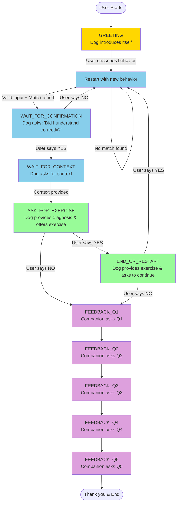

# WuffChat Conversation Flow

## Overview
WuffChat uses a state machine to manage conversations between users and two AI agents:
- **Dog Agent**: Responds from the dog's perspective (main conversationalist)
- **Companion Agent**: Handles feedback collection at the end

## Complete Conversation Flow

## Conversation Example

### 1. GREETING (Dog Agent)
**Dog**: "Wuff! Schön, dass Du da bist. Bitte nenne mir ein Verhalten und ich schildere dir, wie ich es erlebe."

### 2. WAIT_FOR_SYMPTOM
**Human**: "Mein Hund bellt ständig wenn es an der Tür klingelt"
**System**: Searches Weaviate for matching behavior patterns

### 3. WAIT_FOR_CONFIRMATION (Dog Agent)
**Dog**: "Ah, du meinst das Bellen bei der Türklingel! Das kenne ich gut. Soll ich dir mehr dazu erzählen?"

### 4. WAIT_FOR_CONTEXT
**Human**: "Ja"
**Dog**: "In welcher Situation passiert das genau? Erzähl mir mehr über den Kontext."

### 5. Context Analysis & Diagnosis (Dog Agent)
**Human**: "Es passiert immer wenn Besuch kommt, besonders abends"
**Dog**: [Provides instinct-based explanation from dog's perspective]
**Dog**: "Möchtest du eine Übung dazu?"

### 6. Exercise or Feedback
**If YES**: Dog provides training exercise
**If NO**: Companion Agent starts feedback collection

### 7. FEEDBACK Collection (Companion Agent)
**Companion**: Asks 5 questions about the experience
1. How was the conversation?
2. What did you like?
3. What could be improved?
4. Would you recommend WuffChat?
5. Contact info (optional)

## Key Components

### State Management
- **FlowEngine** (`src/core/flow_engine.py`): FSM with 11 states and 12 events
- **SessionState** (`src/models/session_state.py`): Tracks current state and conversation history

### Business Logic
- **FlowHandlers** (`src/core/flow_handlers.py`): Implements logic for each state
- **ValidationService** (`src/services/validation_service.py`): Input validation (25+ chars, dog-related)

### Agents
- **DogAgent** (`src/agents/dog_agent.py`): Generates dog perspective responses
- **CompanionAgent** (`src/agents/companion_agent.py`): Handles feedback collection

### External Services
- **WeaviateService**: Vector search for symptom matching
- **GPTService**: Text generation for responses
- **RedisService**: Optional feedback storage

## Validation Flow

1. **Length Check**: Minimum 25 characters for symptom/context
2. **Content Check**: Must be dog-related (keyword matching + GPT validation)
3. **Yes/No Check**: For confirmation questions
4. **Error Handling**: User-friendly messages from dog's perspective

## Special Features

- **Restart Command**: Users can type "neu" or "restart" at any time
- **Graceful Error Handling**: All errors shown as friendly dog messages
- **Lazy Service Loading**: Services initialize on first use to prevent startup failures

## Code Entry Points

To understand the flow programmatically:

1. Start with `FlowEngine._setup_transitions()` to see state machine definition
2. Follow `FlowHandlers.handle_symptom_input()` for main conversation logic
3. Check `DogAgent._handle_response()` for response generation
4. Review `CompanionAgent.respond()` for feedback handling

## Testing the Flow

Use the Postman collection at `tests/postman/` to test the complete flow:
1. POST `/flow_intro` - Start conversation
2. POST `/flow_step` - Send user messages
3. Follow the state transitions through completion