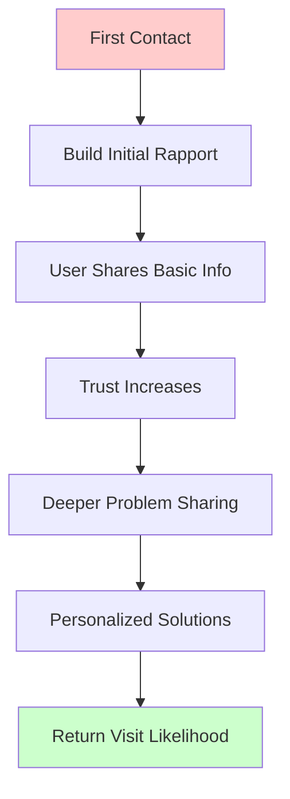
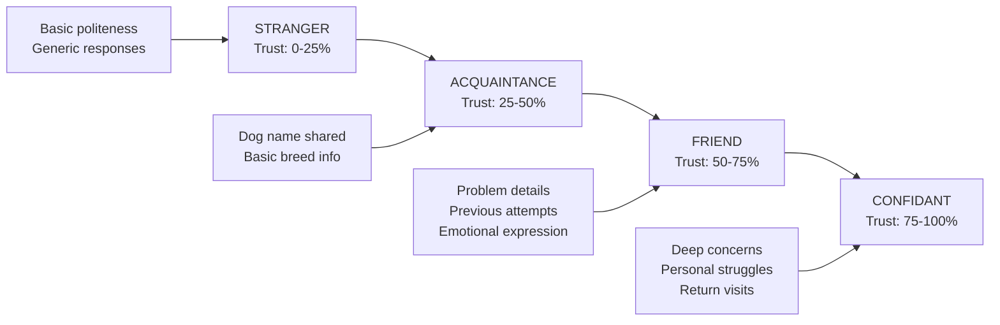
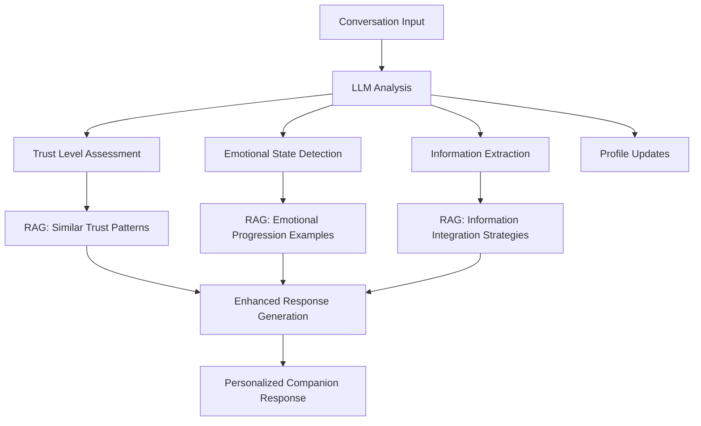

# WuffChat Profile & Rapport Building System

## Conversation Summary: Trust-Building Funnel Strategy

### Problem Statement
Current WuffChat V2 conversation flow is "static and boring, not engaging" - lacks personalization, memory, and relationship building. Users have anonymous sessions that disappear with no emotional connection or reason to return.

### Core Vision: Trust-Building Funnel
Build a system where **rapport → information sharing → deeper problems → return visits**



### Trust Level Progression Model



## Implementation Strategy: AI-First + RAG-First

### Core Principles Established
1. **AI-First Approach**: Use LLM analysis for everything - trust detection, emotion tracking, profile building
2. **RAG-First Architecture**: Vector search + LLM synthesis, not rule-based systems
3. **Organic Information Collection**: Extract profile data naturally through conversation, not forms
4. **Existing Infrastructure**: Leverage PostgreSQL + Weaviate (with Personalization Agent)
5. **Companion Agent**: Primary vehicle for rapport building and trust development

### Profile Data Strategy
**Organic Extraction Through Conversation Analysis**:
- Dog information (name, breed, age, personality traits)
- Owner context (experience level, living situation, family dynamics)
- Problem context (duration, severity, previous attempts, emotional impact)
- Trust indicators (information sharing depth, emotional openness, engagement quality)
- Return behavior (likelihood to return, conversation depth progression)

### Technical Architecture Decisions

#### Persistence Strategy
- **PostgreSQL**: Primary storage for user profiles, conversation history, trust progression
- **Weaviate**: Vector storage for conversation patterns, personalization, RAG queries
- **No Redis**: Avoid temporary storage, go straight to permanent solution

#### AI Analysis Approach


#### Data Model Concepts
```typescript
interface TrustLevel {
  STRANGER: 1,    // First contact, building initial rapport
  ACQUAINTANCE: 2, // Basic info shared, some trust established  
  FRIEND: 3,      // Personal details shared, return visitor
  CONFIDANT: 4    // Deep problems shared, high trust
}

interface RapportContext {
  trust_level: TrustLevel;
  conversation_count: number;
  information_shared: Dict<string, any>;
  emotional_state: string[];
  readiness_to_change: number; // 0.0 to 1.0
  return_likelihood: number;   // Predicted return probability
}
```

## RAG Collections for Conversation Intelligence

### Proposed Vector Collections
1. **ConversationPatterns**: Trust progression examples, emotional journeys, information revelation patterns
2. **EmotionalProgression**: Successful emotional transitions, breakthrough moments, mood improvement examples
3. **TrustBuildingSuccess**: Resistance overcome examples, rapport techniques, trust level achievements
4. **CompanionResponses**: Effective companion agent responses by trust level and emotional state
5. **PersonalizedTraining**: Adaptation examples for different user profiles and contexts

## Integration with Existing V2 Architecture

### Enhancement Points
- **Companion Agent**: Primary rapport building orchestrator
- **FlowHandlers**: Enhanced with RAG conversation analysis
- **SessionState**: Extended with RapportContext and organic profile data
- **Weaviate Service**: Leveraged for personalization agent and conversation pattern matching

### Architecture Options Discussed

**Option A: RAG-Enhanced FlowHandlers**
- Integrate RAG directly into existing handler methods
- Minimal architectural changes
- Risk of coupling

**Option B: Separate RAGService Architecture** 
- Dedicated RAG conversation intelligence service
- Clean separation of concerns
- Better for pushing RAG limits

## Key Questions for Implementation

### Immediate Decisions Needed
1. **Information Collection Flow**: Organic during conversation vs dedicated onboarding
2. **Architecture Integration**: Enhance existing handlers vs separate RAG service
3. **Persistence Implementation**: PostgreSQL schema design and integration approach
4. **Testing Strategy**: How to measure rapport building effectiveness

### Strategic Decisions
1. **Trust Level Progression**: How to determine level transitions with AI analysis
2. **RAG Limits Exploration**: Which boundaries to test (multi-hop reasoning, real-time personalization, conversation memory)
3. **Companion Agent Role**: Primary RAG orchestrator vs enhanced agent among others

## Success Metrics & Testing

### Outcome-Based Measurement
- **Engagement Depth**: Messages exchanged, personal information shared, conversation duration
- **Emotional Progression**: Sentiment improvement, trust indicator detection, emotional stability
- **Return Behavior**: Return visit rates, session depth progression, relationship building success
- **Value Delivery**: Problem clarity achieved, actionable advice acceptance, user commitment expressed

### Testing Approaches
- Online user testing with session recordings
- Post-conversation micro-surveys for emotional impact
- A/B testing rapport-building vs direct problem-solving approaches
- Return visit tracking and conversation depth analysis

## Next Steps Framework

### Week 1: Foundation
- Basic organic profile extraction during conversation
- Simple trust level calculation using AI analysis
- Companion Agent enhancement with basic personalization

### Week 2: RAG Integration
- Conversation pattern storage in Weaviate
- RAG-powered response enhancement
- PostgreSQL schema implementation

### Week 3: Advanced Features
- Multi-hop RAG conversation analysis
- Personalized training plan generation using Weaviate Personalization Agent
- Advanced trust progression tracking

## Technical Notes

### AI-First Commitments
- **"WE MUST ALWAYS GO AI FIRST"** - use LLM analysis over rule-based systems
- **RAG over GPT** - vector search + synthesis approach for all intelligence
- **Explore RAG limits** - test boundaries of what's possible with conversation intelligence

### Existing Infrastructure Leverage
- **PostgreSQL**: Available with "click of a button"
- **Weaviate**: Existing vector search with Personalization Agent
- **Companion Agent**: Existing rapport-building focused agent
- **V2 Architecture**: Clean FSM foundation ready for enhancement

---

*This document captures the strategic direction for transforming WuffChat from anonymous chatbot to personalized relationship-building AI companion through organic profile collection and trust-based conversation intelligence.*