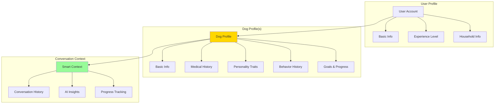

# 🐕 WuffChat User & Dog Profiles: UX Strategy

## Vision: From Chatbot to Personalized Pet Platform

Transform WuffChat from anonymous conversations to a personalized, long-term relationship platform where the AI truly "knows" each dog and owner.

---

## 🎯 User Experience Strategy

### Core Value Proposition
```
"WuffChat remembers your dog and gets smarter with every conversation"
```

Instead of starting fresh each time, users build a relationship where:
- 🐕 **The AI knows your dog's personality, history, and quirks**
- 📈 **Advice gets more targeted and effective over time**
- 📊 **You can track your dog's behavioral progress**
- 👥 **Multiple family members can contribute insights**

---

## 🏗️ Profile Architecture Strategy

### Information Architecture


### Data Model Strategy
```typescript
// User Profile
interface UserProfile {
  id: string
  email: string
  name: string
  createdAt: Date
  
  // Experience & Context
  dogExperience: 'first-time' | 'experienced' | 'professional'
  householdType: 'single' | 'family' | 'elderly' | 'kids'
  livingSpace: 'apartment' | 'house-small-yard' | 'house-large-yard' | 'farm'
  
  // Preferences
  communicationStyle: 'casual' | 'detailed' | 'scientific'
  language: 'de' | 'en'
  
  dogs: DogProfile[]
}

// Dog Profile - The Star of the Show
interface DogProfile {
  id: string
  userId: string
  
  // Basic Info
  name: string
  breed: string
  age: number
  gender: 'male' | 'female'
  size: 'toy' | 'small' | 'medium' | 'large' | 'giant'
  photo?: string
  
  // Behavioral Fingerprint
  personality: {
    energy: 1-10
    sociability: 1-10
    anxiety: 1-10
    dominance: 1-10
    playfulness: 1-10
  }
  
  // Historical Context
  background: {
    rescue: boolean
    previousOwners: number
    knownTrauma?: string[]
    training: 'none' | 'basic' | 'advanced' | 'professional'
  }
  
  // Health Context
  health: {
    conditions?: string[]
    medications?: string[]
    specialNeeds?: string[]
  }
  
  // AI Learning Data
  behaviorInsights: BehaviorInsight[]
  conversationSummaries: ConversationSummary[]
  progressTracking: ProgressTrack[]
}

// AI-Generated Insights
interface BehaviorInsight {
  id: string
  dogId: string
  insight: string
  confidence: number
  source: 'conversation' | 'pattern-analysis' | 'user-input'
  createdAt: Date
}
```

---

## 🎨 UI/UX Design Principles

### 1. **Dog-Centric Design Language**
```css
/* Design System Inspired by Dogs */
Colors:
  Primary: Warm golden (#F4A460) - "Golden Retriever"
  Secondary: Deep brown (#8B4513) - "Chocolate Lab" 
  Accent: Playful orange (#FF6347) - "Energy"
  Success: Forest green (#228B22) - "Growth"
  Background: Cream white (#FFF8DC) - "Comfort"

Typography:
  Headings: Rounded, friendly sans-serif (Nunito)
  Body: Clean, readable (Inter)
  Playful: Handwritten style for dog quotes

Imagery:
  Illustrations over photos
  Warm, hand-drawn style
  Consistent dog breed representations
```

### 2. **Progressive Information Architecture**
```
Onboarding Flow:
Step 1: "Tell us about yourself" (2 minutes)
Step 2: "Let's meet your dog" (3 minutes)  
Step 3: "Quick personality check" (2 minutes)
Step 4: "First conversation" (immediate value)

Total: 7 minutes to personalized experience
```

### 3. **Mobile-First Profile Experience**
```typescript
// Profile Page Hierarchy (Mobile)
ProfilePage = {
  Hero: DogPhotoCard,           // Emotional connection first
  QuickStats: BehaviorSummary,  // Key insights visible
  ActionCards: [
    "Start Conversation",
    "Update Profile", 
    "View Progress",
    "Training Goals"
  ],
  RecentActivity: ConversationHistory,
  Insights: AIGeneratedInsights
}
```

---

## 🚀 Implementation Strategy

### Phase 1: Foundation (2-3 weeks)
```yaml
Backend (V2 Extension):
  - [ ] Add authentication system (Auth0/Firebase)
  - [ ] Create profile data models
  - [ ] Extend session state with user context
  - [ ] Add profile CRUD endpoints
  
Frontend:
  - [ ] Design profile creation flow
  - [ ] Build dog profile cards
  - [ ] Implement photo upload
  - [ ] Create progress dashboard

Effort: Medium - builds on your excellent V2 architecture
```

### Phase 2: AI Personalization (2-3 weeks)
```yaml
AI Enhancement:
  - [ ] Context-aware prompt system
  - [ ] Conversation memory integration
  - [ ] Behavioral pattern recognition
  - [ ] Progress tracking algorithms
  
UX Polish:
  - [ ] Animated progress indicators
  - [ ] Smart suggestions
  - [ ] Personalized conversation starters
  - [ ] Achievement system

Effort: Medium-High - requires AI/ML work
```

### Phase 3: Advanced Features (3-4 weeks)
```yaml
Power User Features:
  - [ ] Multiple dog management
  - [ ] Family member sharing
  - [ ] Veterinarian reports
  - [ ] Training goal tracking
  - [ ] Photo timeline
  - [ ] Behavior analytics

Effort: High - complex feature development
```

---

## 🎨 Outstanding UI Concepts

### 1. **"Dog Personality Radar"**
```typescript
// Interactive personality visualization
<PersonalityRadar>
  <RadarPoint axis="Energy" value={8} />
  <RadarPoint axis="Sociability" value={6} />
  <RadarPoint axis="Anxiety" value={3} />
  <RadarPoint axis="Dominance" value={4} />
  <RadarPoint axis="Playfulness" value={9} />
</PersonalityRadar>

// Shows breed typical vs individual dog
// Animated, interactive, beautiful
```

### 2. **"Conversation Memory Cards"**
```typescript
// Beautiful conversation summaries
<MemoryCard>
  <Date>3 weeks ago</Date>
  <Insight>"Max gets anxious during thunderstorms"</Insight>
  <Progress>Applied thunder training → 40% improvement</Progress>
  <Photo>Before/after videos</Photo>
</MemoryCard>
```

### 3. **"Smart Conversation Starters"**
```typescript
// AI-generated conversation prompts
<ConversationStarters>
  <Prompt urgency="high">
    "Max has been pulling on leash more lately..."
  </Prompt>
  <Prompt type="checkup">
    "How's the thunder training going?"
  </Prompt>
  <Prompt type="discovery">
    "Tell me about Max's favorite games"
  </Prompt>
</ConversationStarters>
```

### 4. **"Progress Celebration"**
```typescript
// Gamified progress tracking
<ProgressCelebration>
  <Achievement>
    🎉 "Max learned 'stay' command!"
    <ShareButton />
  </Achievement>
  <Milestone>
    📈 "3 months of consistent training"
  </Milestone>
</ProgressCelebration>
```

---

## 📱 Mobile UX Wireframes

### Profile Creation Flow
```
Screen 1: Welcome
┌─────────────────────┐
│ 🐕 "Let's meet      │
│     your dog!"      │
│                     │
│ [Photo Upload]      │
│                     │
│ Name: [_______]     │
│ Breed: [Dropdown]   │
│ Age: [__] years     │
│                     │
│ [Continue] ────────→│
└─────────────────────┘

Screen 2: Personality (Playful)
┌─────────────────────┐
│ "How energetic      │
│  is Max?"           │
│                     │
│ 😴────🐕────🚀      │
│ Sleepy  Active  Hyper│
│                     │
│ [Slider Interface]  │
│                     │
│ [Back] [Continue]   │
└─────────────────────┘

Screen 3: First Chat
┌─────────────────────┐
│ 🐕 Max's Profile    │
│ ┌─────────────────┐ │
│ │ "Hi! I'm Max's  │ │
│ │ AI personality. │ │
│ │ What's on your  │ │
│ │ mind today?"    │ │
│ └─────────────────┘ │
│                     │
│ [Start Chatting]    │
└─────────────────────┘
```

### Profile Dashboard
```
┌─────────────────────┐
│ 📷 Max              │
│ Golden Retriever, 3 │
│                     │
│ 🎯 Current Goals    │
│ • Leash training    │
│ • Socialization     │
│                     │
│ 📈 This Week        │
│ • 3 conversations   │
│ • 2 breakthroughs   │
│                     │
│ [Chat Now]          │
│ [View Progress]     │
│ [Edit Profile]      │
└─────────────────────┘
```

---

## 🧠 AI Personalization Strategy

### Context-Aware Conversations
```python
# Enhanced prompt generation with profiles
def generate_personalized_prompt(user_profile, dog_profile, conversation_context):
    context = f"""
    You are speaking with {user_profile.name} about their {dog_profile.breed} 
    named {dog_profile.name} (age {dog_profile.age}).
    
    Dog personality: {format_personality(dog_profile.personality)}
    Recent concerns: {get_recent_patterns(dog_profile.id)}
    Progress tracking: {get_active_goals(dog_profile.id)}
    
    Conversation style: {user_profile.communication_style}
    Experience level: {user_profile.dog_experience}
    """
    
    return build_context_aware_prompt(context, conversation_context)
```

### Smart Insights Generation
```python
# AI-generated behavioral insights
class BehaviorInsightEngine:
    def analyze_conversation_patterns(self, dog_id: str):
        conversations = get_recent_conversations(dog_id)
        
        insights = []
        # Pattern recognition
        if frequent_topic("barking", conversations):
            insights.append(
                "Max's barking seems triggered by doorbell sounds. "
                "Consider desensitization training."
            )
        
        # Progress tracking
        if improvement_detected("leash_pulling", conversations):
            insights.append(
                "Great progress on leash training! "
                "Max is 60% less reactive than last month."
            )
            
        return insights
```

---

## 💡 Unique UX Innovations

### 1. **"Dog Voice Consistency"**
Each dog gets a unique conversational personality:
```
Max (Energetic Golden Retriever):
"Woof! I just LOVE when new people come over! 
But I know I shouldn't jump... it's so hard to contain my excitement!"

Luna (Calm Border Collie):
"I've been observing this pattern in my behavior. 
When the mailman comes, I feel the need to alert the pack systematically."
```

### 2. **"Family Collaboration"**
Multiple users can contribute to one dog's profile:
```
Mom: "Max pulled on the leash today"
Dad: "But he did great with 'stay' command"
Kids: "He was scared of the vacuum again"

→ AI combines all perspectives for complete picture
```

### 3. **"Behavioral Photo Journal"**
Visual progress tracking:
```
Before: Photo of Max jumping on guests
Training: Video of training sessions
After: Photo of Max calmly greeting visitors
→ Visual story of progress
```

### 4. **"Smart Reminders"**
AI suggests check-ins:
```
"It's been 2 weeks since we talked about Max's separation anxiety. 
How's he doing when you leave for work?"
```

---

## 📊 Success Metrics & Analytics

### User Engagement Metrics
```yaml
Key Metrics:
  Profile Completion Rate: >85%
  Return User Rate: >60% (vs <20% anonymous)
  Conversation Depth: +150% (personalized vs generic)
  Goal Achievement: Track training progress completion
  
Advanced Metrics:
  AI Accuracy: User validation of insights
  Relationship Depth: Conversation intimacy scoring
  Platform Stickiness: Days between conversations
```

### Business Impact
```yaml
Value Propositions:
  User Retention: 3x longer engagement
  Premium Features: Profile-based subscription model
  Community Building: User-generated content
  Partnerships: Veterinarian/trainer integrations
```

---

## 🎯 Technical Implementation Notes

### Your V2 Architecture Advantages
```yaml
Perfect Foundation:
  ✅ Clean FSM: Easy to add profile context
  ✅ Service Layer: Simple to add UserService, DogService
  ✅ Prompt Manager: Context-aware prompt generation
  ✅ Agent System: Personalization layer fits perfectly
  ✅ Test Coverage: Reliable foundation for new features
```

### Database Extensions
```sql
-- Simple additions to your architecture
CREATE TABLE users (
  id UUID PRIMARY KEY,
  email VARCHAR UNIQUE,
  profile JSONB,
  created_at TIMESTAMP
);

CREATE TABLE dogs (
  id UUID PRIMARY KEY,
  user_id UUID REFERENCES users(id),
  profile JSONB,
  created_at TIMESTAMP
);

CREATE TABLE conversations (
  id UUID PRIMARY KEY,
  dog_id UUID REFERENCES dogs(id),
  summary JSONB,
  insights JSONB,
  created_at TIMESTAMP
);
```

### API Extensions
```python
# Simple additions to your V2 API
@app.post("/profile/dog")
async def create_dog_profile(profile: DogProfileCreate):
    # Builds on your existing patterns
    
@app.get("/profile/dog/{dog_id}/insights")  
async def get_dog_insights(dog_id: str):
    # AI-generated behavioral insights
```

---

## 🚀 Quick Start Recommendation

### Minimal Viable Profile (MVP) - 1 week
```yaml
Core Features:
  - [ ] Simple dog profile (name, breed, age, photo)
  - [ ] Basic personality traits (3-4 sliders)
  - [ ] Profile-aware conversations
  - [ ] Conversation history per dog

Impact: Immediate personalization, foundation for growth
Effort: Low - leverages your excellent V2 architecture
```

### This transforms WuffChat from:
**"A helpful dog behavior chatbot"**
↓
**"Your dog's personal AI companion that knows them deeply"**

The emotional connection and practical value increase dramatically. Users will love seeing their dog's "personality" recognized and watching progress over time.

**Want to explore any specific aspect deeper? UI mockups, technical architecture, or user journey mapping?** 🎨

---

*This is genuinely exciting - profiles would make WuffChat incredibly engaging and valuable!* 🐕✨