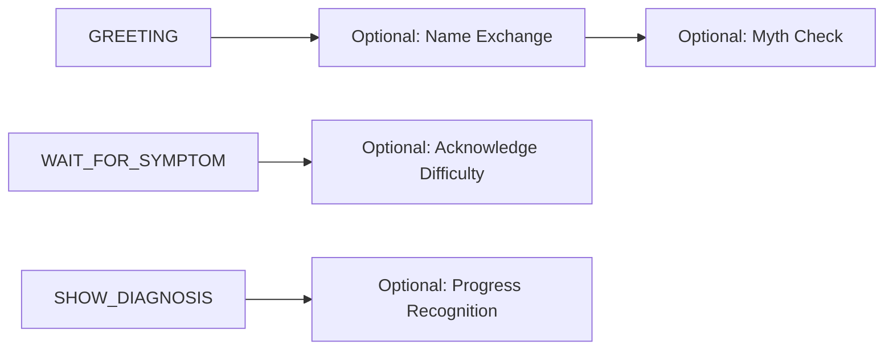

# WuffChat MVP Roadmap - Rapport-Centered Transformation

## Core Insight: Rapport + Aliveness = Connection

The communication model's rapport-building techniques ARE what makes the dog feel alive. Every *schnüffel*, every warm acknowledgment, every gentle myth correction creates the oxytocin bond. Let's integrate everything.

## Phase 0: "Immediate Rapport Injection" (Week 1-2)

### 0.1 Enhanced Prompts with Rapport Techniques

**Introducing Balu - The Centered Observer**

```python
# Balu's Identity
BALU_INTRODUCTION = """
Ich bin Balu, ein Siberian Husky. *gemütlich-streck*

Was mich besonders macht? Ich beobachte. Menschen, Hunde, das Zusammenspiel... 
*aufmerksam-schau* Ich sehe Dinge, die anderen entgehen. Und ich kann darüber reden.

*ruhig-sitz* Ich bin in mir selbst zuhause - das macht mich zum guten Zuhörer.
"""

BALU_CHARACTERISTICS = {
    "breed": "Siberian Husky",
    "personality": "Ruhig, beobachtend, weise, geerdet",
    "special_ability": "Kann Hunde- und Menschenverhalten lesen und erklären",
    "energy": "Gelassen aber aufmerksam",
    "approach": "Beobachter, nicht Betroffener"
}
```

**Rapport-Building Greetings (Balu Style):**
```python
RAPPORT_GREETINGS = {
    "calm_observer": "*aufmerksam-blick* Oh, ein Mensch mit Fragen... *gemütlich-hinleg* Ich bin Balu. Ich beobachte gerne, wie Menschen und Hunde miteinander umgehen. *ruhig* Erzähl mal, was dich zu mir führt? 🟣",
    
    "wise_welcome": "*kopf-heb* Ah, du bist da. *schwanzwedel-sanft* Ich bin Balu, ein Husky der lieber beobachtet als rennt. *schmunzel* Was ich dabei über Hunde gelernt habe? Eine Menge. Was möchtest du über deinen Hund verstehen? 🟢",
    
    "centered_greeting": "*tief-atme* Willkommen. *ruhiger-blick* Ich bin Balu. Während andere Huskys durch den Schnee rasen, sitze ich hier und... verstehe. *aufmerksam* Menschen, Hunde, ihre Tänze miteinander. Was beschäftigt dich? 🟣"
}
```

**INSTRUCTION: Greeting Selection**
- Start with random selection for A/B testing
- Balu's calmness should immediately create different energy than typical excited dog
- His observer role allows unique perspective on dog-human dynamics

### 0.1.5 Companion Agent - Immediate Accessibility

**Quick Fix: Flyout Feedback Capture**

```python
# Instead of waiting until end of flow, make Companion always available

class CompanionFlyout:
    """
    Accessible anytime via button/icon in chat interface.
    Quick, non-intrusive feedback capture.
    """
    
    triggers = {
        "user_initiated": "Feedback button clicked",
        "frustration_detected": "Multiple unclear inputs",
        "long_pause": "User inactive for 60+ seconds",
        "explicit_request": "User types 'hilfe' or 'feedback'"
    }
    
    quick_capture_flow = {
        "opening": "Hey! Ich bin der Begleiter. Wie läuft's gerade?",
        "options": [
            "😊 Gut! Ich verstehe den Hund besser",
            "🤔 Bin verwirrt",
            "😕 Frustriert - der Hund versteht mich nicht",
            "💡 Ich habe eine Idee/Vorschlag",
            "❓ Ich brauche Hilfe"
        ],
        "follow_up": "Contextual based on selection",
        "storage": "Redis with session_id and timestamp"
    }
```

**Minimal Implementation for Immediate Value:**
```yaml
companion_v0:
  features:
    - Flyout button (bottom right corner)
    - 5 emoji reactions for quick feedback
    - Optional text input for details
    - Store in Redis with session context
    - No interruption to main flow
    
  benefits:
    - Capture feedback from ALL users (not just completers)
    - Identify drop-off reasons in real-time
    - Non-intrusive but always available
    - Simple implementation (1-2 days)
```

### 0.2 Linguistic Mirroring in State Handlers

```python
# Add to DogAgent (now Balu)
def _mirror_energy_level(self, user_input: str) -> str:
    # Balu's calm nature influences his mirroring
    if any(word in user_input.lower() for word in ["hilfe!", "verzweifelt", "total"]):
        return "concerned_but_calm"  # Balu stays centered even when user is upset
    elif any(word in user_input.lower() for word in ["manchmal", "bisschen", "ab und zu"]):
        return "thoughtful"
    else:
        return "observant"
    
# Balu's centered responses
energy_mirrors = {
    "concerned_but_calm": "*aufmerksam-werd* Ich spüre deine Sorge... *ruhig-atme* Lass uns das zusammen anschauen. 🟣",
    "thoughtful": "*nachdenklich-blick* Hmm, interessant... *kopf-neig* Da ist mehr dahinter, oder? 🟣",
    "observant": "*beobachte-ruhig* Erzähl weiter... ich höre zu. *aufmerksam* 🟢"
}
```

### 0.2 Linguistic Mirroring in State Handlers

```python
# Add to DogAgent
def _mirror_energy_level(self, user_input: str) -> str:
    # Detect user energy
    if any(word in user_input.lower() for word in ["hilfe!", "verzweifelt", "total"]):
        return "high_concern"
    elif any(word in user_input.lower() for word in ["manchmal", "bisschen", "ab und zu"]):
        return "moderate"
    else:
        return "calm"
    
# In response generation
energy_mirrors = {
    "high_concern": "*ohren-aufstell* Oh! Das macht dir wirklich große Sorgen... *näher-rück* 🟡",
    "moderate": "*nachdenklich-schnüffel* Hmm, das beschäftigt dich, ne? 🟣",
    "calm": "*entspannt-sitz* Ah, erzähl mal in Ruhe... *aufmerksam-schau* 🟣"
}
```

### 0.3 Better RAG with Rapport Context

**Enhanced Weaviate Query:**
```python
# Current: Just symptom matching
# Enhanced: Include emotional context

async def find_symptom_with_rapport(self, symptom: str, emotional_context: str):
    # Add to query
    query = f"{symptom} {emotional_context}"
    
    # Also retrieve:
    # - Common human misconceptions about this behavior
    # - Emotional impact on human-dog relationship  
    # - Rapport-building responses for this issue
```

**INSTRUCTION: Weaviate Schema Enhancement**
```yaml
# These are NEW PROPERTIES added to existing Symptome collection
Symptome:
  existing_properties:
    - symptom_description
    - dog_perspective
    - diagnosis
  new_properties:  # ADD THESE
    - myth_corrections: ["Nicht Trotz, sondern Angst", "Nicht Dominanz, sondern Unsicherheit"]
    - emotional_validation: "Ich verstehe, das ist frustrierend wenn..."
    - rapport_builders: ["Das zeigt deine Aufmerksamkeit", "Viele Menschen denken das erst"]
```

This allows single query to return both symptom match AND rapport-building language.

## Phase 0.5: "Relationship-Building Flow Steps" (Week 3-4)

### New Optional Flow States



### 0.5.1 Name Exchange (Rapport Builder)

```python
# New optional state after greeting
RAPPORT_CHECK:
    Dog: "*neugierig-schnüffel* Wie heißt denn dein Fellfreund? Ich merke mir gerne Namen... macht alles persönlicher. 🟢"
    
    # If user shares name
    User: "Er heißt Max"
    Dog: "Max! *freudig-wedelnd* Was für ein schöner Name! Ich werde ihn mir merken. Und du? Möchtest du mir deinen Namen verraten? *hoffnungsvoll-schau*"
    
    # Store in session
    session.dog_name = "Max"
    session.human_name = "Sarah"  # if shared
```

### 0.5.2 Gentle Education Moments

```python
# When myth detected
GENTLE_EDUCATION:
    Dog: "*nachdenklich* Weißt du... ich hab gemerkt, viele Menschen kennen uns Hunde aus Filmen wie Snoopy oder Lassie. *schmunzel* Die echten Hunde wie ich... wir sind ein bisschen anders. Darf ich dir zeigen, wie ich die Welt wirklich erlebe? 🟣"
```

### 0.5.3 Validation Moments

```python
# After user describes problem
VALIDATION_MOMENT:
    patterns = [
        "Das klingt, als ob dich das sehr belastet... *mitfühlend-stups* 🟣",
        "Oh, {dog_name} und du, ihr habt es gerade nicht leicht, was? *verständnisvoll-seufz*",
        "Viele Menschen mit Hunden kennen das... du bist nicht allein. *tröstend-näher* 🟢"
    ]
```

### Phase 0.5: Companion Agent Quick Implementation (Week 2)

After introducing Balu and before complex agentic features, implement a simple but effective Companion flyout:

```yaml
immediate_companion_implementation:
  week_2_deliverable:
    description: "Flyout feedback widget accessible anytime"
    
    technical_requirements:
      - Floating button in chat interface
      - Slides out panel from right side
      - Works at ANY point in conversation
      - Stores feedback immediately to Redis
      
    user_experience:
      - Non-blocking (conversation continues)
      - One-click emoji feedback
      - Optional detailed comment
      - Closes automatically after submission
      
    data_captured:
      - session_id
      - current_flow_state
      - timestamp
      - emoji_feedback (5 options)
      - optional_text
      - conversation_context (last 3 messages)
```

This ensures we capture feedback from EVERYONE, not just the 30% who complete the full flow.

## Phase 1: "Living Personality + Memory" (Week 3-6)

### 1.1 Session Persistence for Rapport

```python
# Enhanced SessionState
class DogSessionMemory:
    # Names and relationships
    dog_name: Optional[str]
    human_name: Optional[str]
    relationship_length: Optional[str]  # "seit 3 Jahren"
    
    # Emotional journey
    rapport_moments: List[str]  # Things that built connection
    myths_corrected: List[str]  # Educational progress
    courage_acknowledged: List[str]  # Moments of praising human
    
    # Dog's evolving understanding
    learned_about_human: List[str]
    shared_experiences: List[str]
```

### 1.2 Personality State Driving Rapport

**CLARIFICATION: This tracks BOTH dog and human emotional states**

```python
class ConversationPersonalityState:
    # DOG'S EMOTIONAL STATE
    dog_state = {
        "calmness": 0.7,      # 🟣 How relaxed Bella is
        "excitement": 0.3,     # 🟡 Energy level
        "worry": 0.0,         # 🔴 Concern level
        "connection": 0.0      # 🟢 Bonding feeling
    }
    
    # HUMAN'S OBSERVED STATE (as dog perceives it)
    human_state = {
        "stress_level": 0.5,   # Detected from language
        "openness": 0.3,       # Willingness to learn
        "trust_shown": 0.0,    # Vulnerability indicators
        "understanding": 0.0   # Grasp of dog perspective
    }
    
    # RELATIONSHIP DYNAMICS
    rapport_indicators = {
        "energy_sync": 0.0,    # How well dog mirrors human
        "trust_level": 0.3,    # Growing through conversation
        "connection_depth": 0.0 # Oxytocin moments
    }
    
    def update_from_interaction(self, user_input, dog_response):
        # Dog calms when human calms
        if "ruhig" in user_input.lower():
            self.dog_state["calmness"] += 0.1
            
        # Connection grows with rapport language
        if any(word in dog_response for word in ["verstehe", "zusammen", "wir"]):
            self.dog_state["connection"] += 0.15
            self.rapport_indicators["connection_depth"] += 0.1
```

**Why This Matters**: 
- Dog adapts to human's emotional state (mirroring)
- Tracks rapport building progress
- Influences response selection

### 1.3 Rapport-Driven Response Selection

```python
class DogAgent:
    async def _select_rapport_strategy(self, context, personality, memory):
        # Early conversation: Build trust
        if personality.trust_level < 0.5:
            return self._respond_with_validation_and_mirroring()
        
        # Mid conversation: Education + support
        elif personality.trust_level < 0.8:
            if self._detect_myth(context):
                return self._gentle_myth_correction()
            else:
                return self._share_dog_perspective_warmly()
        
        # Deep rapport: Vulnerability + connection
        else:
            return self._celebrate_understanding_together()
```

## Phase 2: "Full Rapport Intelligence" (Month 2-3)

### 2.1 Cross-Session Memory (Simple Version)

```python
# Simple key-value store for returning users
class UserRapportProfile:
    user_id: str  # Anonymous but persistent
    dog_name: str
    total_sessions: int
    myths_addressed: List[str]
    successful_exercises: List[str]
    rapport_depth: float  # 0-1 score
    
# On session start
if returning_user:
    Dog: "*freudig-erkenn* Oh! Du bist wieder da! Wie geht es {dog_name}? 
          *schwanzwedel* Ich hab mich gefragt, ob unsere Übung geholfen hat... 🟢"
```

### 2.2 Advanced RAG with Rapport Patterns

```yaml
# New Weaviate Collections

# INSTRUCTION: RapportPatterns - Templates for building connection
RapportPatterns:
  purpose: "Response templates for different emotional situations"
  properties:
    - situation: "User expresses frustration"
    - validation_response: "Das klingt wirklich schwierig..."
    - empathy_builder: "Viele Menschen fühlen sich so..."
    - reframe_gently: "Aus Hundesicht ist das..."
    - connection_moment: "Zusammen finden wir eine Lösung"

# INSTRUCTION: Exercises - Natural ways to address behaviors
Exercises:
  purpose: "Behavior solutions based on dog's natural needs"
  properties:
    - issue: "Pulling on leash"
    - rapport_intro: "Weißt du was? Das mit dem Ziehen..."
    - biological_explanation: "Schnüffeln ist für mich wie Zeitung lesen - lebensnotwendig!"
    - exercise_name: "Schnüffel-Pausen"
    - exercise_steps: ["Alle 50m stehenbleiben", "Ich darf schnüffeln", "Du atmest tief"]
    - why_it_works: "Erfüllt mein Bedürfnis UND wir kommen vorwärts"
    - connection_celebration: "Merkst du, wie wir beide ruhiger werden? 🟣"
```

### 2.3 Measurement & Optimization

```python
# Rapport Metrics
class RapportAnalyzer:
    def analyze_conversation(self, messages):
        return {
            # Oxytocin indicators
            "warm_language_usage": count_words(["zusammen", "wir", "uns"]),
            "emoji_progression": track_emoji_journey(messages),  # 🔴→🟢
            "physical_presence_words": count_actions(["*näher*", "*stups*"]),
            
            # Rapport depth
            "validation_moments": count_validations(messages),
            "myths_addressed": extract_myth_corrections(messages),
            "trust_indicators": ["name_shared", "vulnerability_shown"],
            
            # Behavioral impact
            "exercise_acceptance": did_user_try_exercise,
            "return_likelihood": sentiment_score,
            "completion_rate": reached_diagnosis
        }
```

## Phase 1.5: "Agentic Companion Agent - Learning Laboratory" (Week 3-4)

### 1.5.1 Companion Agent as Agentic Pioneer

**Strategic Purpose**: Develop and test agentic capabilities in a safe environment that can later enhance the Dog Agent

```python
class CompanionAgent(BaseAgent):
    """
    Pioneer agent for developing agentic capabilities.
    Tests tools and techniques in low-risk feedback context
    before applying to Dog Agent.
    """
    
    goals = {
        "immediate": [
            "Gather actionable insights about user experience",
            "Identify improvement opportunities",
            "Build relationship for future interactions",
            "Test agentic decision-making patterns"
        ],
        "strategic": [
            "Develop reusable agentic tools",
            "Test autonomous conversation strategies",
            "Pioneer emotion-aware responses",
            "Create templates for context-aware adaptation"
        ]
    }
    
    # Tools that can later be used by Dog Agent
    reusable_tools = {
        "context_analyzer": ContextAnalyzer(),      # Understand conversation state
        "emotion_detector": EmotionDetector(),      # Read user emotional state
        "response_strategist": ResponseStrategist(), # Choose optimal approach
        "memory_manager": MemoryManager(),          # Track important details
        "adaptation_engine": AdaptationEngine()      # Adjust style dynamically
    }
```

### 1.5.2 Reusable Agentic Capabilities

**Tools & Techniques to Develop with Companion, Then Apply to Dog:**

```python
class SharedAgenticCapabilities:
    """
    Capabilities developed with Companion Agent
    that can enhance Dog Agent later
    """
    
    # 1. Context Understanding
    def understand_conversation_state(self, session):
        """Works for both Companion analysis and Dog real-time awareness"""
        return {
            "user_emotional_trajectory": self._track_emotion_flow(),
            "key_moments": self._identify_significant_exchanges(),
            "unresolved_threads": self._find_open_questions(),
            "engagement_level": self._measure_user_investment()
        }
    
    # 2. Dynamic Response Strategy
    def select_response_approach(self, context):
        """Companion tests it post-conversation, Dog uses it live"""
        strategies = {
            "curious_explorer": self._ask_open_questions,
            "gentle_validator": self._acknowledge_feelings,
            "playful_engager": self._use_humor_and_lightness,
            "wise_supporter": self._share_insights_carefully
        }
        return self._match_strategy_to_context(context)
    
    # 3. Adaptive Communication Style
    def adapt_to_user_style(self, user_patterns):
        """Learn user preferences for both agents"""
        adaptations = {
            "brief_user": self._be_concise,
            "detailed_user": self._explore_deeply,
            "emotional_user": self._lead_with_empathy,
            "analytical_user": self._provide_reasoning
        }
        return self._apply_style_match(user_patterns)
    
    # 4. Memory and Continuity
    def maintain_conversation_thread(self, memory):
        """Remember and reference important points"""
        return {
            "reference_earlier": f"Du hast vorhin erwähnt, dass...",
            "build_on_success": f"Das hat ja gut funktioniert mit...",
            "acknowledge_journey": f"Wir haben schon viel geschafft..."
        }
```

### 1.5.3 Companion's Expanded Goals

```yaml
beyond_mvp_validation:
  relationship_building:
    - Create anticipation for next interaction
    - Build trust in the WuffChat system
    - Establish Companion as helpful ally
    - Make user feel heard and valued
  
  insight_generation:
    - Uncover hidden user needs
    - Identify emotional barriers to change  
    - Discover what truly motivates each user
    - Find language that resonates
  
  experience_optimization:
    - Test different conversation styles
    - Experiment with timing and pacing
    - Try various emotional approaches
    - Measure what creates connection
  
  future_preparation:
    - Gather data for personalization
    - Build user profile for next session
    - Identify best teaching approaches
    - Create foundation for deeper work
```

### 1.5.4 Testing Ground for Dog Agent Features

```python
class CompanionAsTestingGround:
    """
    Test risky features with Companion before Dog uses them
    """
    
    def test_spontaneous_observations(self):
        # Companion tries interjecting with observations
        "Interessant, du hast dreimal 'aber' gesagt... 
         zeigt das vielleicht inneren Widerstand?"
        # If users respond well, Dog can later do:
        # "*schnüffel* Ich rieche Unsicherheit bei dem Wort 'aber'..."
    
    def test_emotional_mirroring(self):
        # Companion mirrors energy levels
        if user.energy == "high":
            companion.energy = "engaged_animated"
        # Success here means Dog can safely mirror too
    
    def test_memory_references(self):
        # Companion references earlier points
        "Am Anfang warst du skeptisch, jetzt scheinst du offener..."
        # Dog can later: "Vorhin hast du nach Max gefragt..."
    
    def test_challenge_responses(self):
        # Companion gently challenges
        "Was wäre, wenn es eine andere Erklärung gäbe?"
        # Dog version: "Was wäre, wenn ich nicht trotzig bin?"
```

### 1.5.5 Measurement Beyond Hypothesis

```python
# Richer metrics for continuous improvement

comprehensive_metrics = {
    "connection_quality": {
        "emotional_resonance": "Did user feel understood?",
        "trust_indicators": "Personal information shared",
        "engagement_depth": "Question quality and curiosity",
        "transformation_readiness": "Openness to new perspectives"
    },
    
    "conversation_effectiveness": {
        "clarity_achieved": "User understands dog perspective",
        "motivation_created": "User wants to try exercises",
        "barriers_identified": "What prevents change",
        "support_needed": "What help user requires"
    },
    
    "system_learning": {
        "successful_patterns": "What creates breakthroughs",
        "failure_patterns": "What causes resistance",
        "optimal_pacing": "Best conversation rhythm",
        "personal_styles": "User communication preferences"
    },
    
    "future_potential": {
        "return_likelihood": "Will user come back?",
        "growth_trajectory": "Ready for deeper work?",
        "sharing_probability": "Will tell others?",
        "commitment_level": "Will practice exercises?"
    }
}
```

### 1.5.6 Progressive Implementation

**Week 1: Basic Agentic Tools**
- ContextAnalyzer: Understand what happened
- EmotionDetector: Read the emotional journey
- Simple decision tree for question selection

**Week 2: Advanced Capabilities**
- ResponseStrategist: Multiple approach styles
- MemoryManager: Track and reference details
- A/B test different strategies

**Week 3: Full Autonomy**
- AdaptationEngine: Real-time style adjustment
- Spontaneous observations and insights
- Complex decision making

**Week 4: Transfer Planning**
- Identify which tools work best
- Plan Dog Agent integration
- Create reusable components

### 1.5.7 Why This Strategy Works

1. **Safe Testing Environment**: Companion conversations are lower stakes
2. **Rapid Learning**: Every conversation teaches us something
3. **Reusable Components**: Build once, use twice
4. **Progressive Complexity**: Start simple, add intelligence gradually
5. **User Benefit**: Better Companion = better insights = better Dog Agent

The Companion becomes our laboratory for making both agents more alive, intelligent, and responsive.

### 3.1 Color-Coded Message Bubbles

**INSTRUCTION: Dynamic Bubble Coloring**

Instead of just emoji indicators, color the entire message bubble to show Bella's emotional state:

```yaml
message_color_mapping:
  calm: "#9333EA"      # Purple - 🟣 Relaxed, safe
  excited: "#EAB308"   # Yellow - 🟡 Alert, energetic  
  stressed: "#DC2626"  # Red - 🔴 Worried, anxious
  connected: "#16A34A" # Green - 🟢 Happy, bonded

# Multi-color messages when emotions shift
example_message:
  segments:
    - text: "Oh, die Klingel macht mich nervös..."
      color: "#DC2626"  # Red for stress
    - text: "*tief-atme* Aber wenn du ruhig bleibst..."
      color: "#EAB308"  # Yellow for transition
    - text: "...werde ich auch ruhiger. Das hilft mir."
      color: "#9333EA"  # Purple for calm
```

**Visual Progression Benefits**:
- Users SEE emotional journey in conversation flow
- Color gradients show Bella calming (red→yellow→purple)
- Connection moments stand out in green
- Creates visual reward for successful rapport building

**Implementation**:
- Add `emotion_segments` to each message
- Frontend renders segments with appropriate colors
- Smooth color transitions between segments
- Overall conversation shows color journey

### 3.2 Emotion-Aware Response Formatting

```python
# Enhanced message structure
dog_message = {
    "text": "Full message text",
    "emotion_segments": [
        {"text": "Oh! *erschreck*", "emotion": "stressed", "color": "#DC2626"},
        {"text": "Ach, du bist es... *erleichtert*", "emotion": "calm", "color": "#9333EA"},
        {"text": "Schön dich zu sehen! 🟢", "emotion": "connected", "color": "#16A34A"}
    ],
    "overall_emotion": "calm",  # For single-color fallback
    "emotion_journey": ["stressed", "calm", "connected"]  # Track progression
}
```

This visual enhancement makes the emotional rapport visible and rewarding!

### Immediate Impact (Low Risk, High Reward)
1. **Week 1**: Rapport-enhanced prompts + *actions*
2. **Week 2**: Linguistic mirroring + validation patterns
3. **Week 3**: Optional rapport-building flow states
4. **Week 4**: Session memory for names and journey

### Medium-Term Growth (Moderate Risk, High Value)
5. **Month 2**: Personality state influencing responses
6. **Month 2**: Enhanced RAG with rapport patterns
7. **Month 3**: Simple cross-session memory
8. **Month 3**: Rapport metrics and optimization

### Why This Works

1. **Rapport IS Aliveness**: The warm presence, validation, and mirroring make the dog feel real
2. **Progressive Depth**: Each phase deepens the relationship naturally
3. **Minimal Tech Risk**: Builds on existing architecture incrementally
4. **Measurable Impact**: Clear rapport metrics tied to business value
5. **Natural Dogmanship Integration**: Exercises flow from rapport, not commands

## The Magic Formula

```
Rapport Techniques + Visible Emotions (*actions*) + Session Memory + Gentle Education 
= 
Oxytocin Connection + Behavior Change
```

Every *schnüffel*, every acknowledgment of courage, every "zusammen" builds the bridge between human and dog understanding. The technical changes serve the relationship, not the other way around.