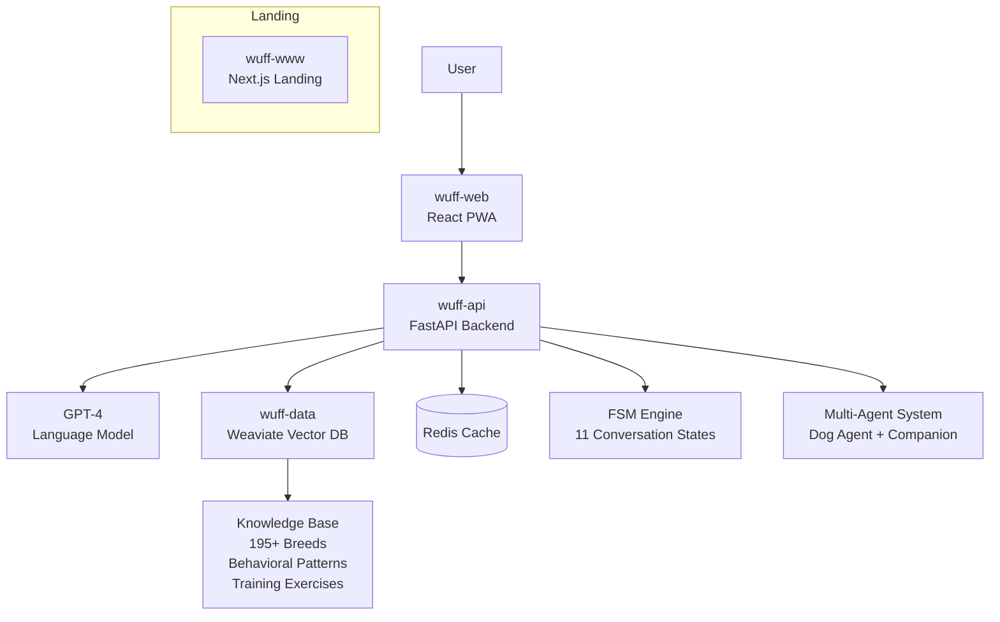

# WuffChat - AI Dog Behavior Platform

**Production V2**: Enhanced FSM with GPT-4 integration | **V3 Development**: BDI autonomous agent architecture

An AI-powered conversational platform that helps dog owners understand canine behavior through natural language interactions. The system provides behavioral insights from the dog's perspective using scientific instinct models and conversational AI.

## Technical Architecture

**Current Production (V2)**: FSM-based conversation flow with Weaviate RAG integration  
**In Development (V3)**: BDI (Beliefs-Desires-Intentions) autonomous agent architecture



### Core Features
- **11-State FSM**: Natural conversation flow without rigid forms
- **Vector Knowledge Base**: Weaviate database with 195+ dog breeds and behavioral patterns
- **Multi-Agent System**: Dog agent (Balu) and companion agent for dual perspectives
- **Emotional Intelligence**: Presence markers and energy mirroring for rapport building
- **Instinct-Based Analysis**: Explains behaviors through Hunt, Territory, Pack, and Sexual drives

### Frontend Architecture
- **React 19 PWA**: Installable mobile-first application
- **Vite Build**: Optimized ~63KB gzipped bundle
- **Offline Support**: Service worker for disconnected usage

### Backend Architecture  
- **FastAPI**: Async microservices with Redis caching
- **GPT-4 Integration**: Context-aware conversational responses
- **Security**: API key auth, session tokens, rate limiting, CORS
- **Health Monitoring**: Comprehensive error handling and logging

## Multi-Repository Structure

Four specialized repositories comprise the WuffChat ecosystem:

| Repository | Stack | Purpose |
|------------|-------|---------|
| [wuff-api](https://github.com/kemperfekt/wuff-api) | FastAPI, GPT-4, Redis | Backend services and AI integration |
| [wuff-web](https://github.com/kemperfekt/wuff-web) | React 19, Vite, PWA | Frontend application |
| [wuff-data](https://github.com/kemperfekt/wuff-data) | Weaviate, Python | Knowledge base and vector operations |
| [wuff-www](https://github.com/kemperfekt/wuff-www) | Next.js | Landing page |

## Live Application

**Try WuffChat**: [app.wuffchat.de](https://app.wuffchat.de)

## V3 Roadmap

- **BDI Agent Framework**: Autonomous goal-driven behavior
- **Persistent Memory**: Cross-session conversation context
- **Advanced RAG**: Dynamic behavioral pattern analysis
- **Personalized Training Plans**: Instinct-matched exercise recommendations

## Development

```bash
# Setup all repositories
git clone https://github.com/kemperfekt/wuffchat
# See individual repos for specific setup instructions
```

**Key Design Principles:**
- Content-as-code knowledge management
- Graceful degradation without optional services
- Modular microservices architecture
- A/B testing framework integration

---

**Technical Documentation**: [Complete Architecture Guide](https://github.com/kemperfekt/dogbot)

*Bridging human language and canine communication through conversational AI*