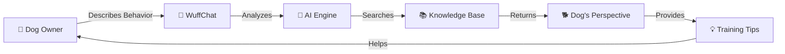
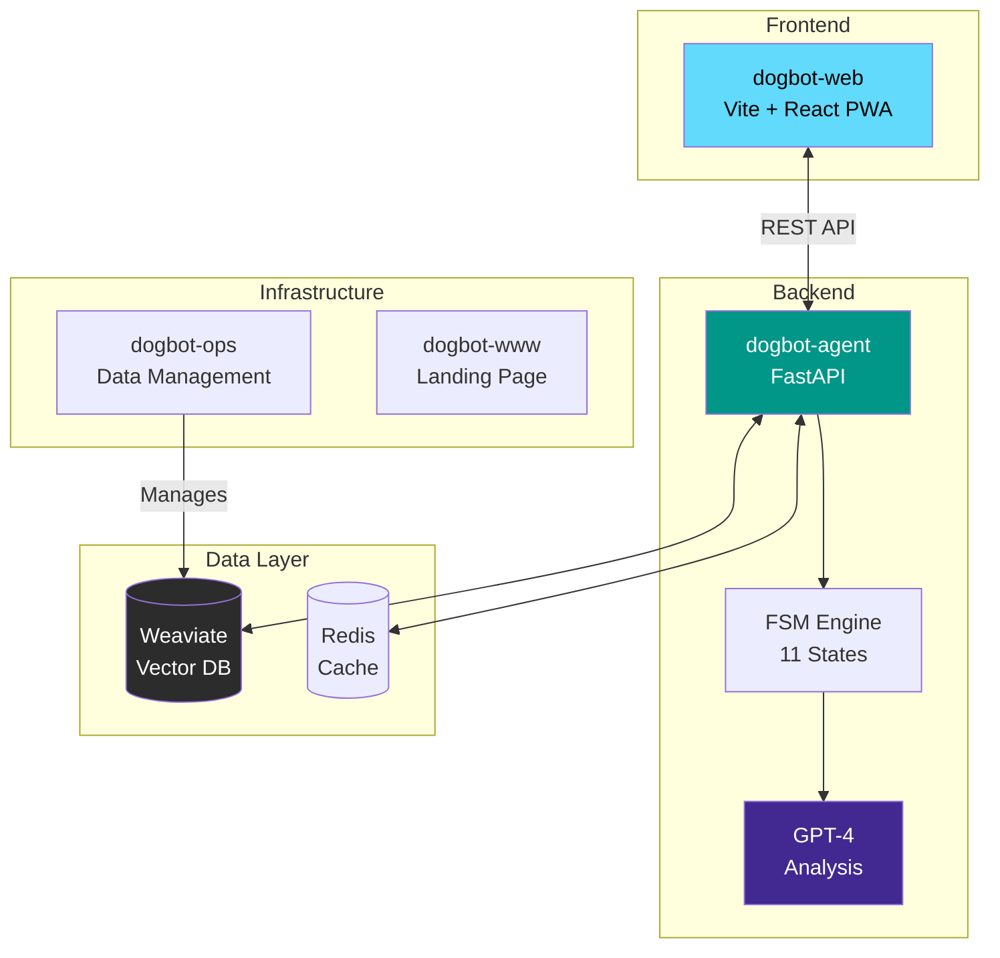
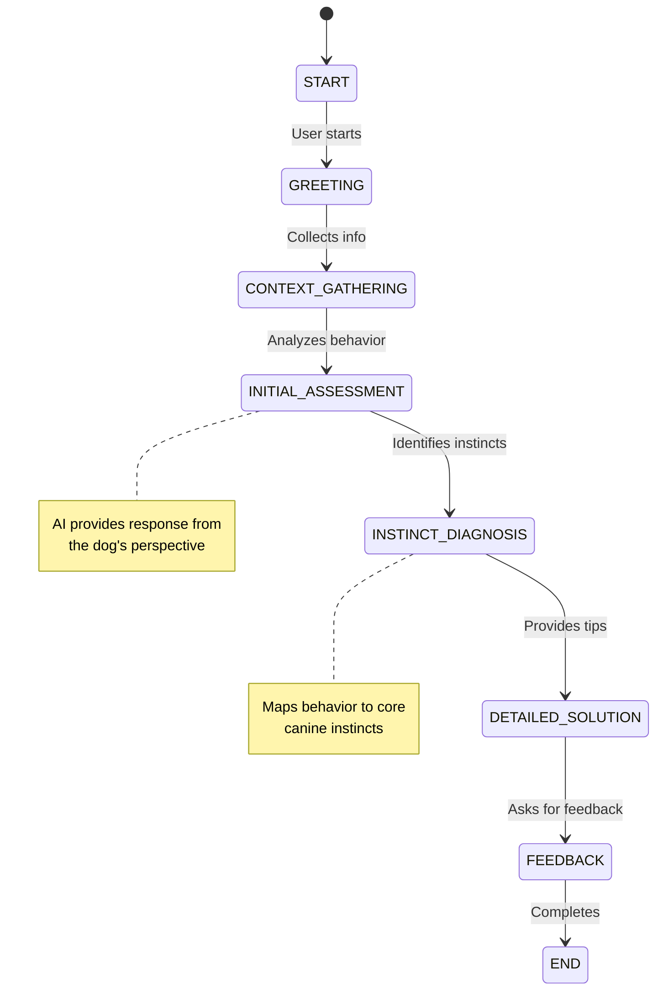
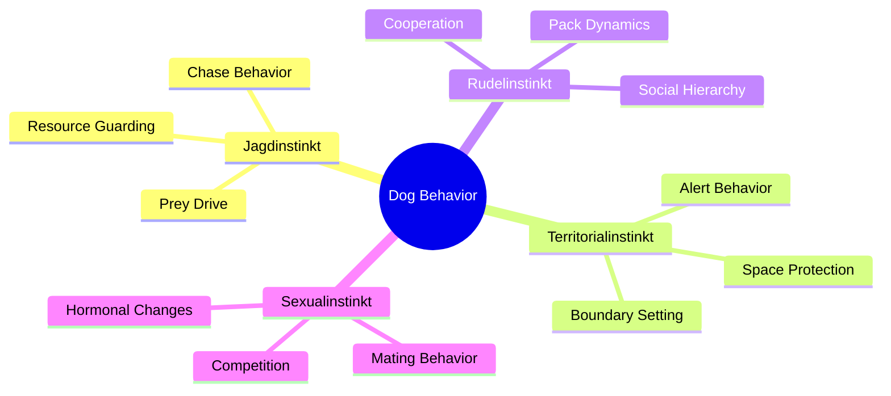
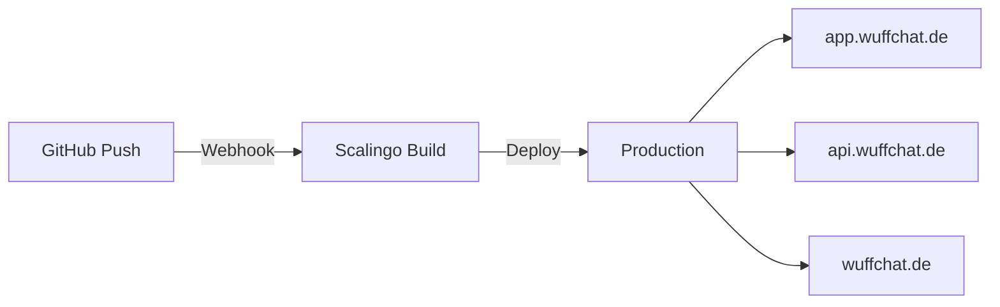

# WuffChat - Frontend Application

A modern, secure PWA version of WuffChat built with Vite, React, and Tailwind CSS.

> **Note**: This is the migrated frontend that replaced the old Create React App version.

---

## 🎯 What is WuffChat?

**WuffChat** is an AI-powered conversational assistant that helps dog owners understand their furry friends by **explaining behavior from the dog's perspective**. Using advanced AI and a comprehensive knowledge base about canine instincts, WuffChat provides empathetic, instinct-based behavioral analysis.

> **Technical Note**: This project is internally referred to as "DogBot" in repositories and code. WuffChat is the public-facing brand name.



## 🏗️ Architecture Overview



## 🚀 Quick Start

```bash
# Clone the meta repository
git clone https://github.com/kemperfekt/dogbot.git
cd dogbot

# Start the backend
cd dogbot-agent
pip install -r requirements.txt
export OPENAI_API_KEY=your_key_here
uvicorn src.main:app --port 8000

# In a new terminal, start the frontend
cd ../dogbot-web
npm install
npm run dev

# Set up environment
cp .env.development.template .env.development
# Edit .env.development and add your API key

# Start development server
npm run dev

## 📦 Repository Structure

| Repository | Purpose | Tech Stack | Status |
|------------|---------|------------|--------|
| **[dogbot-agent](https://github.com/kemperfekt/dogbot-agent)** | Backend API & AI Logic | FastAPI, GPT-4, Weaviate | ✅ Production |
| **[dogbot-web](https://github.com/kemperfekt/dogbot-web)** | Chat Interface | Vite, React, PWA, Tailwind | ✅ Production |
| **[dogbot-ops](https://github.com/kemperfekt/dogbot-ops)** | Data & Schema Management | Python, Content-as-Code | ✅ Active |
| **[dogbot-www](https://github.com/kemperfekt/dogbot-www)** | Landing Page | Static HTML, Tailwind | ✅ Live |

## 🧠 How It Works

### Conversation Flow



### Core Instincts Model

WuffChat analyzes behavior through four fundamental canine instincts:



## 🔧 Development

### Local Development Setup

Each repository has its own development environment:

```bash
# Backend development
cd dogbot-agent
python -m venv venv
source venv/bin/activate  # or `venv\Scripts\activate` on Windows
pip install -r requirements.txt
pytest  # Run tests

# Frontend development
cd dogbot-web
npm install
npm test

# Build for production
npm run build

# Preview production build
npm run preview
```

## 🔧 Features

- ⚡ **Vite** - Lightning fast development
- 📱 **PWA** - Installable as mobile app
- 🎨 **Tailwind CSS** - Utility-first styling
- 🔒 **Secure** - 0 vulnerabilities
- 🧪 **Vitest** - Modern testing framework
- 📦 **TypeScript Ready** - Can be gradually added

## 📱 PWA Features

- **Installable**: Users can install as native app
- **Offline Support**: Basic offline functionality
- **Auto-Update**: Automatic updates without app store
- **Native Feel**: Full-screen, native-like experience

## 🛡️ Security

- Environment variables properly configured
- No hardcoded secrets
- Modern dependency management
- HTTPS ready

## 🚀 Deployment

### Static Hosting (Recommended)
```bash
npm run build
# Upload dist/ folder to any static host
```

### Environment Variables
```env
VITE_API_URL=https://your-api-domain.com
VITE_API_KEY=your_production_api_key
```

**dogbot-web/.env.development**
```env
VITE_API_URL=http://localhost:8000
VITE_API_KEY=your_api_key_here
```

## 📊 Performance

- **Bundle Size**: ~63KB gzipped
- **Build Time**: <2 seconds
- **Dev Server**: <50ms hot reload
- **Lighthouse Score**: 95+ (PWA optimized)

## 🔄 Migration from Create React App

This version replaces the old Create React App with:
- ✅ 0 vulnerabilities (vs 9 vulnerabilities)
- ✅ 10x faster development
- ✅ 50% smaller bundle size
- ✅ PWA capabilities
- ✅ Modern tooling



### Manual Deployment

```bash
# Deploy backend
cd dogbot-agent
git push scalingo main

# Deploy frontend
cd dogbot-web
git push scalingo main
```

## 📊 API Documentation

The API is fully documented with OpenAPI/Swagger:

- **Local**: http://localhost:8000/docs
- **Production**: https://api.wuffchat.de/docs

### Key Endpoints

| Endpoint | Method | Description |
|----------|--------|-------------|
| `/health` | GET | Health check |
| `/start-conversation` | POST | Begin new chat |
| `/send-message` | POST | Send message |
| `/feedback` | POST | Submit feedback |

## 🧪 Testing

```bash
# Run all tests
cd dogbot-agent && pytest
cd ../dogbot-web && npm test

# Run specific test suites
pytest tests/test_flow_engine.py
npm test -- --coverage
```

## 🤝 Contributing

We welcome contributions! Please see our [Contributing Guide](./CONTRIBUTING.md) for details.

### Development Workflow

1. Fork the repository
2. Create a feature branch (`git checkout -b feature/amazing-feature`)
3. Commit your changes (`git commit -m 'Add amazing feature'`)
4. Push to the branch (`git push origin feature/amazing-feature`)
5. Open a Pull Request

## 🛡️ Security & Privacy

- All conversations are anonymous
- No personal data is stored without consent
- OpenAI API calls use anonymized prompts
- See our [Privacy Policy](https://wuffchat.de/datenschutz.html)

## 📄 License

This project is licensed under the MIT License - see the [LICENSE](./LICENSE) file for details.


## 📝 Naming Convention

- **WuffChat**: Public-facing product name (used in marketing, UI, and customer communication)
- **DogBot**: Internal technical name (used in code, repositories, and technical documentation)

This dual naming allows us to maintain technical consistency while presenting a friendly brand to users.

---

Built with ❤️ using Vite + React
