# WuffChat - AI-Powered Dog Behavior Assistant

> **Understand your dog's behavior from their perspective with autonomous AI agents and advanced vector knowledge retrieval**

An innovative conversational AI system that bridges the communication gap between dogs and their humans through empathetic behavioral analysis, powered by autonomous agent architecture and semantic knowledge graphs.

## 🎯 What Makes WuffChat Special

**WuffChat** revolutionizes pet consultation by combining cutting-edge AI technologies:

- **🧠 Autonomous Agents**: True agentic BDI (Beliefs-Desires-Intentions) architecture - no rigid conversation flows
- **🔍 Vector Knowledge Base**: Semantic search through expert-curated behavioral data using Weaviate
- **🐕 Dog's Perspective**: Unique instinct-based analysis explaining behavior from the dog's viewpoint
- **⚡ Infrastructure as Code**: Automated schema management and knowledge deployment

```mermaid
graph LR
    A[🧑 Dog Owner] -->|Describes Behavior| B[💬 WuffChat Agent]
    B -->|Autonomously Decides| C[🧠 Vector Search]
    C -->|Retrieves| D[📚 Expert Knowledge]
    D -->|Provides| E[🐕 Dog's Perspective]
    E -->|Delivers| F[💡 Actionable Insights]
```



## 🚀 Key Innovations

### Autonomous Agent Architecture
- **No Scripted Flows**: Agent makes independent decisions about conversation direction
- **Dynamic Tool Usage**: Intelligent selection of knowledge retrieval tools based on context
- **Belief Management**: Persistent understanding of dog, owner, and situation evolves throughout conversation

### Semantic Knowledge Engine
- **Vector Database**: Weaviate-powered similarity search across behavioral patterns
- **Content as Code**: Automated pipeline from Excel expertise to searchable knowledge graphs
- **Instinct Modeling**: Four-pillar canine psychology framework (Hunting, Territorial, Pack, Sexual instincts)

### Production-Ready Infrastructure
- **Database as Code**: Automated schema deployment and content management
- **Security First**: Comprehensive rate limiting, session management, and input validation
- **Progressive Web App**: Installable mobile experience with offline capabilities

## 📦 Architecture Overview

This project consists of four specialized repositories working in harmony:

### 🔧 **[Backend API](https://github.com/kemperfekt/dogbot-api)**
*Autonomous agent backend with FastAPI and GPT-4 integration*

- **V3 Agentic Architecture**: BDI pattern with autonomous decision-making
- **Tool Integration**: WeaviateKnowledgeTool for behavioral insights
- **Security Features**: Rate limiting, session management, comprehensive input validation
- **Production Deployment**: Auto-scaling on Scalingo with health monitoring

### 🎨 **[Frontend App](https://github.com/kemperfekt/dogbot-web)**
*Modern React PWA with real-time chat interface*

- **Vite + React**: Lightning-fast development and optimal production builds
- **Progressive Web App**: Installable mobile experience with offline support
- **Real-time Communication**: Seamless agent conversation with typing indicators
- **Performance Optimized**: 95+ Lighthouse score, ~63KB gzipped bundle

### 📊 **[Data Management](https://github.com/kemperfekt/dogbot-data)**
*Knowledge base infrastructure and content pipeline*

- **Vector Database Operations**: Automated Weaviate schema and content deployment
- **Content as Code**: Excel → JSON → Vector Database pipeline
- **Expert Knowledge**: Curated behavioral data with breed-specific instinct mappings
- **Database as Code**: Reproducible knowledge base setup and updates

### 🌐 **[Landing Page](https://github.com/kemperfekt/dogbot-www)**
*Public-facing website and marketing presence*

## 🛠️ Quick Development Setup

```bash
# Clone the meta repository
git clone https://github.com/kemperfekt/dogbot.git
cd dogbot

# Backend setup (V3 agentic architecture)
cd dogbot-api
python -m venv .venv && source .venv/bin/activate
pip install -r requirements.txt
export OPENAI_APIKEY=your_key WEAVIATE_URL=your_url WEAVIATE_API_KEY=your_key
python -m uvicorn src.main:app --port 8000

# Frontend setup (in new terminal)
cd ../dogbot-web
npm install && cp .env.development.template .env.development
npm run dev

# Access the application
# Frontend: http://localhost:3000
# API Docs: http://localhost:8000/docs
```

## 🧠 Technical Highlights

### Autonomous Decision Making
Unlike traditional chatbots with predetermined flows, WuffChat's agent autonomously:
- Decides what questions to ask based on current beliefs
- Chooses appropriate knowledge retrieval tools
- Adapts conversation style to owner's communication preferences
- Determines when sufficient information has been gathered

### Vector-Powered Knowledge Retrieval


### Infrastructure as Code
- **Automated Schema Management**: Database structure versioned and deployable
- **Content Pipeline**: Expert knowledge flows from Excel to production vector database
- **Environment Parity**: Development mock services mirror production behavior

## 🌟 What Makes This Special

1. **True Agency**: No state machines or rigid flows - the AI agent decides conversation direction
2. **Semantic Understanding**: Vector similarity search finds relevant knowledge even for novel situations  
3. **Expert Knowledge at Scale**: Behavioral expertise encoded in searchable, relationship-rich data structures
4. **Production-Grade Security**: Enterprise-level authentication, rate limiting, and input validation
5. **Infrastructure Automation**: Database schema and content deployment fully automated

## 🔗 Repository Links

| Component | Repository | Purpose |
|-----------|------------|---------|
| **Backend** | [dogbot-api](https://github.com/kemperfekt/dogbot-api) | Agentic FastAPI backend with GPT-4 integration |
| **Frontend** | [dogbot-web](https://github.com/kemperfekt/dogbot-web) | React PWA with real-time chat interface |
| **Data** | [dogbot-data](https://github.com/kemperfekt/dogbot-data) | Vector database management and content pipeline |
| **Landing** | [dogbot-www](https://github.com/kemperfekt/dogbot-www) | Public website and marketing presence |

## 🚀 Live Application

**Experience WuffChat**: [wuffchat.de](https://wuffchat.de)

---

*Built with autonomous agents, vector databases, and a deep understanding of canine psychology*
